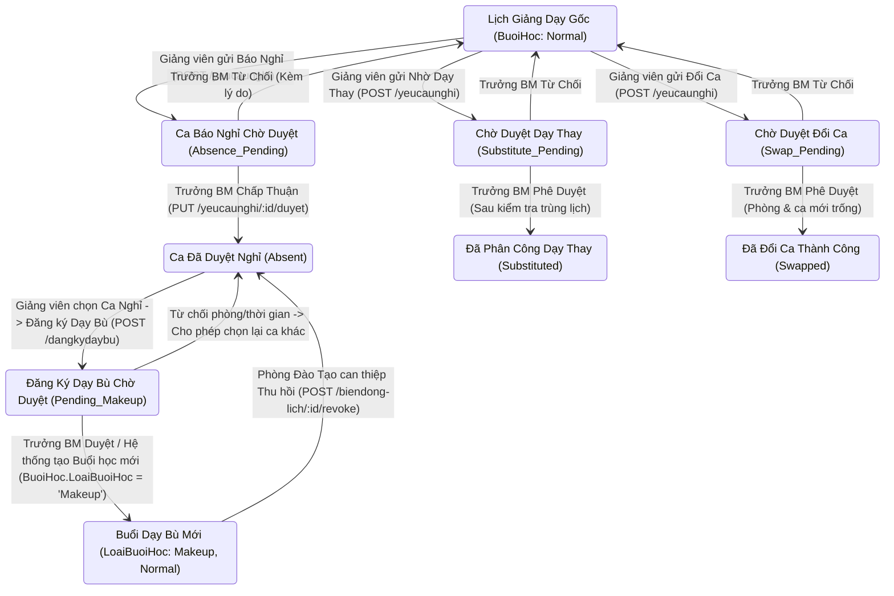

# TÀI LIỆU CHI TIẾT NGHIỆP VỤ TỪNG CHỨC NĂNG (FUNCTIONAL BUSINESS SPECIFICATION)

**Dự án**: Hệ thống Quản lý Lịch Giảng Dạy & Thời khóa biểu Trường Đại học (`LichGiangDay`)  
**Phân hệ**: Phân hệ 1: Dữ liệu nền (Master / Base Data), Phân hệ 2: Thời khóa biểu & Xếp lịch học, Phân hệ 3: Biến động lịch & Duyệt yêu cầu giảng dạy (Báo nghỉ, Đổi ca, Dạy thay, Dạy bù)  
**Tác giả**: Business Analyst (BA) & System Architect  
**Ngày cập nhật**: 05/10/2026

---

## 1. PHÂN HỆ 1: PHÂN HỆ DỮ LIỆU NỀN

Phân hệ **Dữ liệu nền** (Base Data) quản lý toàn bộ các danh mục thực thể cốt lõi của nhà trường: cơ sở vật chất hạ tầng (Tòa nhà, Phòng học, Tiết học), cơ cấu tổ chức học thuật (Khoa, Bộ môn, Lớp sinh viên, Khóa sinh viên, Học kỳ), và danh mục người dùng/giảng viên. Đây là nền tảng dữ liệu chuẩn xác để phục vụ cho các phân hệ nghiệp vụ tiếp theo như Quản lý Học phần, Lập kế hoạch giảng dạy, Phân công giảng viên và Xếp Thời khóa biểu tự động.

---

### 1.1. Chức năng 1: Quản lý Tòa nhà (`ToaNha`)

- **Bảng dữ liệu tác động trong CSDL**: **`ToaNha`** (`MaToaNha`, `TenToaNha`, `CoSo`, `DiaChi`).
- **Bảng liên quan (Ràng buộc FK)**: **`PhongHoc`** (`PhongHoc.MaToaNha` $\rightarrow$ `ToaNha.MaToaNha`).
- **Resource ID kiểm tra quyền (`checkPermission`)**: `'ToaNha'` (`CanRead`, `CanCreate`, `CanUpdate`, `CanDelete`).

#### 1.1.1. Tìm kiếm & Hiển thị Danh sách Tòa nhà

- **Thao tác người dùng (User Action)**:
  - Người dùng chọn menu `Dữ liệu nền` (hoặc `Danh mục đào tạo`) $\rightarrow$ `Quản lý Tòa nhà`.
  - Nhập từ khóa vào ô tìm kiếm (Mã tòa nhà, Tên tòa nhà, Cơ sở).
- **Nghiệp vụ xử lý (Business Logic)**:
  - Gửi request `GET /v1/api/toanha?search=...`.
  - Hệ thống kiểm tra quyền `CanRead` trên Resource `ToaNha`.
  - Backend thực hiện truy vấn SQL JOIN đếm số lượng phòng học trực thuộc từng tòa nhà:
    ```sql
    SELECT
      tn.MaToaNha,
      tn.TenToaNha,
      tn.CoSo,
      tn.DiaChi,
      COUNT(ph.MaPhong) AS SoPhongHoc
    FROM ToaNha tn
    LEFT JOIN PhongHoc ph ON tn.MaToaNha = ph.MaToaNha
    GROUP BY tn.MaToaNha, tn.TenToaNha, tn.CoSo, tn.DiaChi
    ORDER BY tn.MaToaNha ASC;
    ```
- **Thay đổi / Trạng thái trong CSDL (Database State & Impact)**:
  - **Không làm thay đổi CSDL** (Chế độ đọc - `SELECT` Read-only).
- **Kết quả hiển thị (UI Response)**:
  - Bảng Data Table hiển thị danh sách các tòa nhà kèm badge số lượng phòng học trực thuộc.

#### 1.1.2. Thêm mới Tòa nhà

- **Thao tác người dùng (User Action)**:
  - Bấm nút **"Thêm Tòa Nhà"**.
  - Nhập thông tin trên Form: **Mã tòa nhà** (`MaToaNha`), **Tên tòa nhà** (`TenToaNha`), **Cơ sở** (`CoSo`), **Địa chỉ** (`DiaChi`).
  - Nhấn **"Lưu Tòa Nhà"**.
- **Nghiệp vụ xử lý (Business Logic)**:
  - Kiểm tra quyền `CanCreate` trên Resource `ToaNha`.
  - **Validation 1**: `MaToaNha` và `TenToaNha` không được để trống.
  - **Validation 2**: Chuẩn hóa `MaToaNha` (Tự động viết hoa `UPPERCASE`, xóa khoảng trắng thừa).
  - **Validation 3 (Check trùng)**: Truy vấn `SELECT MaToaNha FROM ToaNha WHERE MaToaNha = ?`.
    - Nếu đã tồn tại $\rightarrow$ Trả lỗi: _"Mã tòa nhà 'A1' đã tồn tại trong hệ thống."_ (HTTP 400).
- **Thay đổi / Trạng thái trong CSDL (Database State & Impact)**:
  - **Tạo mới 1 dòng bản ghi trong bảng `ToaNha`**:
    ```sql
    INSERT INTO ToaNha (MaToaNha, TenToaNha, CoSo, DiaChi)
    VALUES (?, ?, ?, ?);
    ```
- **Kết quả hiển thị (UI Response)**:
  - Đóng Modal, tải lại bảng dữ liệu, hiển thị dòng tòa nhà mới tạo cùng thông báo thành công.

#### 1.1.3. Cập nhật (Sửa) Thông tin Tòa nhà

- **Thao tác người dùng (User Action)**:
  - Bấm icon **"Sửa"** (Edit) tại dòng tòa nhà tương ứng.
  - Thay đổi **Tên tòa nhà**, **Cơ sở**, hoặc **Địa chỉ**.
  - Nhấn **"Lưu Thay Đổi"**.
- **Nghiệp vụ xử lý (Business Logic)**:
  - Kiểm tra quyền `CanUpdate` trên Resource `ToaNha`.
  - Cố định khóa chính `MaToaNha` (Không cho phép sửa Mã tòa nhà để tránh làm đứt gãy quan hệ khóa ngoại với Phòng học).
  - Validation: `TenToaNha` không được để trống.
- **Thay đổi / Trạng thái trong CSDL (Database State & Impact)**:
  - **Cập nhật các cột của bản ghi trong bảng `ToaNha`**:
    ```sql
    UPDATE ToaNha
    SET TenToaNha = ?, CoSo = ?, DiaChi = ?
    WHERE MaToaNha = ?;
    ```
- **Kết quả hiển thị (UI Response)**:
  - Đóng Modal, hiển thị toast thông báo _"Cập nhật tòa nhà thành công!"_, dữ liệu trên bảng được làm mới.

#### 1.1.4. Xóa Tòa nhà (Kiểm tra Ràng buộc toàn vẹn)

- **Thao tác người dùng (User Action)**:
  - Bấm icon **"Xóa"** (Trash) tại dòng tòa nhà.
  - Xác nhận trên Popup xác nhận xóa.
- **Nghiệp vụ xử lý (Business Logic)**:
  - Kiểm tra quyền `CanDelete` trên Resource `ToaNha`.
  - **Kiểm tra ràng buộc toàn vẹn CSDL (Data Integrity Constraint)**:
    - Backend truy vấn đếm số lượng phòng học trực thuộc tòa nhà này:
      ```sql
      SELECT COUNT(*) AS total FROM PhongHoc WHERE MaToaNha = ?;
      ```
    - **Trường hợp `total > 0`**: **CHẶN XÓA HOÀN TOÀN**. Trả lỗi HTTP 400 Bad Request: _"Không thể xóa tòa nhà 'A1' vì đang có X phòng học trực thuộc. Vui lòng xóa hoặc di chuyển các phòng học trước."_
    - **Trường hợp `total == 0`**: Tiến hành xóa.
- **Thay đổi / Trạng thái trong CSDL (Database State & Impact)**:
  - **Trường hợp xóa thành công**: Bản ghi bị **XÓA VĨNH VIỄN** khỏi bảng `ToaNha`:
    ```sql
    DELETE FROM ToaNha WHERE MaToaNha = ?;
    ```
- **Kết quả hiển thị (UI Response)**:
  - Tòa nhà bị xóa khỏi CSDL và biến mất khỏi bảng danh sách.

---

### 1.2. Chức năng 2: Quản lý Phòng học (`PhongHoc`)

- **Bảng dữ liệu tác động trong CSDL**: **`PhongHoc`** (`MaPhong`, `TenPhong`, `MaToaNha`, `SucChua`, `LoaiPhong`, `TrangThai`).
- **Bảng liên quan (Ràng buộc FK)**:
  - `ToaNha` (`PhongHoc.MaToaNha` $\rightarrow$ `ToaNha.MaToaNha`).
  - `ThoiKhoaBieu` (`ThoiKhoaBieu.MaPhong` $\rightarrow$ `PhongHoc.MaPhong`).
  - `BuoiHoc` (`BuoiHoc.MaPhong` $\rightarrow$ `PhongHoc.MaPhong`).
  - `DangKyDayBu` (`DangKyDayBu.MaPhong` $\rightarrow$ `PhongHoc.MaPhong`).
- **Resource ID kiểm tra quyền (`checkPermission`)**: `'PhongHoc'` (`CanRead`, `CanCreate`, `CanUpdate`, `CanDelete`).

> 📌 **CHÚ THÍCH CÁC TRƯỜNG DỮ LIỆU ĐẶC THÙ TRONG CSDL (`PhongHoc`)**:
>
> - **Cột `TrangThai`**: Lưu giá trị mã chuỗi **`'Ready'`** (Sẵn sàng) hoặc **`'Maintenance'`** (Đang bảo trì).
> - **Cột `LoaiPhong`**: Lưu trực tiếp chuỗi Tiếng Việt thuộc 5 tùy chọn chuẩn hóa:
>   1. `'Phòng lý thuyết'` (Mặc định hệ thống)
>   2. `'Phòng thực hành máy tính'`
>   3. `'Hội trường'`
>   4. `'Phòng thí nghiệm'`
>   5. `'Xưởng thực hành'`

#### 1.2.1. Tìm kiếm, Lọc & Hiển thị Danh sách Phòng học

- **Thao tác người dùng (User Action)**:
  - Người dùng truy cập menu `Dữ liệu nền` $\rightarrow$ `Quản lý Phòng học`.
  - Chọn Bộ lọc: Theo **Tòa nhà** (`MaToaNha`), **Loại phòng** (`LoaiPhong`), **Trạng thái** (`TrangThai`: `Ready` / `Maintenance`) hoặc gõ từ khóa tìm kiếm.
- **Nghiệp vụ xử lý (Business Logic)**:
  - Gửi request `GET /v1/api/phonghoc` kèm tham số lọc.
  - Backend kiểm tra quyền `CanRead` trên Resource `PhongHoc`.
  - Backend truy vấn bảng `PhongHoc` kết hợp JOIN với `ToaNha` để lấy tên tòa nhà và cơ sở hiển thị:
    ```sql
    SELECT
      ph.MaPhong,
      ph.TenPhong,
      ph.MaToaNha,
      tn.TenToaNha,
      tn.CoSo,
      ph.SucChua,
      ph.LoaiPhong,
      ph.TrangThai
    FROM PhongHoc ph
    JOIN ToaNha tn ON ph.MaToaNha = tn.MaToaNha
    ORDER BY ph.MaToaNha ASC, ph.MaPhong ASC;
    ```
- **Thay đổi / Trạng thái trong CSDL (Database State & Impact)**:
  - **Không làm thay đổi CSDL** (`SELECT` Read-only).
- **Kết quả hiển thị (UI Response)**:
  - Hiển thị danh sách phòng học với các Badge trạng thái trực quan:
    - Giá trị CSDL `'Ready'` $\rightarrow$ Hiển thị Badge Xanh lá (**Sẵn sàng**)
    - Giá trị CSDL `'Maintenance'` $\rightarrow$ Hiển thị Badge Cam (**Đang bảo trì**)

#### 1.2.2. Thêm mới Phòng học

- **Thao tác người dùng (User Action)**:
  - Bấm nút **"Thêm Phòng Học"**.
  - Nhập: **Mã phòng** (`MaPhong`), **Tên phòng** (`TenPhong`), Chọn **Tòa nhà** (`MaToaNha`), **Sức chứa** (`SucChua`), **Loại phòng** (`LoaiPhong`).
  - Bấm **"Lưu Phòng Học"**.
- **Nghiệp vụ xử lý (Business Logic)**:
  - Kiểm tra quyền `CanCreate` trên Resource `PhongHoc`.
  - **Validation 1**: `MaPhong`, `TenPhong`, `MaToaNha` không được để trống.
  - **Validation 2**: `SucChua` phải là số nguyên dương $> 0$ (mặc định nếu để trống là `50`).
  - **Validation 3 (Kiểm tra khóa ngoại `MaToaNha`)**: Tòa nhà được chọn phải tồn tại trong bảng `ToaNha`.
  - **Validation 4 (Kiểm tra trùng mã)**: Truy vấn `SELECT MaPhong FROM PhongHoc WHERE MaPhong = ?`.
    - Nếu đã có $\rightarrow$ Trả lỗi: _"Mã phòng học 'A1-101' đã tồn tại trong hệ thống."_ (HTTP 400).
- **Thay đổi / Trạng thái trong CSDL (Database State & Impact)**:
  - **Tạo mới 1 dòng bản ghi trong bảng `PhongHoc`**:
    ```sql
    INSERT INTO PhongHoc (MaPhong, TenPhong, MaToaNha, SucChua, LoaiPhong, TrangThai)
    VALUES (?, ?, ?, ?, ?, ?);
    ```

    - `TrangThai`: Mặc định CSDL tự động gán giá trị chuỗi là **`'Ready'`** (Sẵn sàng phục vụ giảng dạy).
- **Kết quả hiển thị (UI Response)**:
  - Đóng Modal, hiển thị phòng học mới trên danh sách với trạng thái **Ready (Sẵn sàng)**.

#### 1.2.3. Cập nhật (Sửa) Thông tin Phòng học

- **Thao tác người dùng (User Action)**:
  - Bấm icon **"Sửa"** tại dòng phòng học.
  - Chỉnh sửa: Tên phòng, Tòa nhà, Sức chứa, Loại phòng, Trạng thái (`Ready` / `Maintenance`).
  - Nhấn **"Lưu Thay Đổi"**.
- **Nghiệp vụ xử lý (Business Logic)**:
  - Kiểm tra quyền `CanUpdate` trên Resource `PhongHoc`.
  - Cố định `MaPhong`. Nếu đổi sang `MaToaNha` khác, kiểm tra tòa nhà mới có tồn tại trong hệ thống hay không.
- **Thay đổi / Trạng thái trong CSDL (Database State & Impact)**:
  - **Cập nhật các cột tương ứng trong bảng `PhongHoc`**:
    ```sql
    UPDATE PhongHoc
    SET TenPhong = ?, MaToaNha = ?, SucChua = ?, LoaiPhong = ?, TrangThai = ?
    WHERE MaPhong = ?;
    ```
- **Kết quả hiển thị (UI Response)**:
  - Cập nhật thông tin bản ghi trong DB, làm mới bảng dữ liệu.

#### 1.2.4. Đổi Trạng thái Vận hành (Toggle Status: Ready ↔ Maintenance)

- **Thao tác người dùng (User Action)**:
  - Bấm nút **"Bảo Trì"** hoặc **"Mở Sẵn Sàng"** nhanh trên bảng danh sách phòng học.
- **Nghiệp vụ xử lý (Business Logic)**:
  - Kiểm tra quyền `CanUpdate` trên Resource `PhongHoc`.
  - **Trường hợp Chuyển từ `'Ready'` $\rightarrow$ `'Maintenance'`**:
    - Đưa phòng vào trạng thái bảo trì/sửa chữa. Thuật toán xếp thời khóa biểu sẽ loại trừ phòng này khỏi danh sách phòng khả dụng.
  - **Trường hợp Chuyển từ `'Maintenance'` $\rightarrow$ `'Ready'`**:
    - Kích hoạt phòng hoạt động trở lại. Phòng sẽ sẵn sàng để xếp lịch học.
- **Thay đổi / Trạng thái trong CSDL (Database State & Impact)**:
  - **Cập nhật duy nhất cột `TrangThai` trong bảng `PhongHoc`**:
    ```sql
    UPDATE PhongHoc SET TrangThai = ? WHERE MaPhong = ?;
    ```
- **Kết quả hiển thị (UI Response)**:
  - Badge trạng thái trên dòng phòng học lập tức đổi màu (Xanh lá ↔ Cam) và hiển thị nhãn tương ứng (Ready ↔ Maintenance) ngay lập tức.

#### 1.2.5. Xóa Phòng học (Kiểm tra Ràng buộc toàn vẹn)

- **Thao tác người dùng (User Action)**:
  - Bấm icon **"Xóa"** tại dòng phòng học, xác nhận xóa trên Popup.
- **Nghiệp vụ xử lý (Business Logic)**:
  - Kiểm tra quyền `CanDelete` trên Resource `PhongHoc`.
  - **Kiểm tra ràng buộc toàn vẹn CSDL (3 tầng liên kết)**:
    1. **Kiểm tra Thời khóa biểu (`ThoiKhoaBieu`)**:
       ```sql
       SELECT COUNT(*) AS total FROM ThoiKhoaBieu WHERE MaPhong = ?;
       ```

       - Nếu `total > 0` $\rightarrow$ **CHẶN XÓA**: _"Không thể xóa phòng học 'X' vì đang có N lịch học (Thời khóa biểu) được xếp tại phòng này."_
    2. **Kiểm tra Buổi học (`BuoiHoc`)**:
       ```sql
       SELECT COUNT(*) AS total FROM BuoiHoc WHERE MaPhong = ?;
       ```

       - Nếu `total > 0` $\rightarrow$ **CHẶN XÓA**: _"Không thể xóa phòng học 'X' vì đang có N buổi học được gán cho phòng này."_
    3. **Kiểm tra Đăng ký dạy bù (`DangKyDayBu`)**:
       ```sql
       SELECT COUNT(*) AS total FROM DangKyDayBu WHERE MaPhong = ?;
       ```

       - Nếu `total > 0` $\rightarrow$ **CHẶN XÓA**: _"Không thể xóa phòng học 'X' vì đang có N đơn đăng ký dạy bù tại phòng này."_
    - **Trường hợp cả 3 điều kiện đều bằng 0**: Cho phép xóa.
- **Thay đổi / Trạng thái trong CSDL (Database State & Impact)**:
  - **Trường hợp xóa thành công**: Bản ghi bị **XÓA VĨNH VIỄN** khỏi bảng `PhongHoc`:
    ```sql
    DELETE FROM PhongHoc WHERE MaPhong = ?;
    ```
- **Kết quả hiển thị (UI Response)**:
  - Phòng học bị xóa khỏi CSDL và biến mất khỏi bảng danh sách.

---

### 1.3. Chức năng 3: Quản lý Khoa (`Khoa`)

- **Bảng dữ liệu tác động trong CSDL**: **`Khoa`** (`MaKhoa`, `TenKhoa`, `MaTruongKhoa`).
- **Bảng liên quan (Ràng buộc FK)**:
  - `BoMon` (`BoMon.MaKhoa` $\rightarrow$ `Khoa.MaKhoa`).
  - `LopSinhVien` (`LopSinhVien.MaKhoa` $\rightarrow$ `Khoa.MaKhoa`).
  - `GiangVien` (`Khoa.MaTruongKhoa` $\rightarrow$ `GiangVien.MaGiangVien`).
- **Resource ID kiểm tra quyền (`checkPermission`)**: `'Khoa'` (`CanRead`, `CanCreate`, `CanUpdate`, `CanDelete`).

> 📌 **CHÚ THÍCH ĐẶC THÙ NGHIỆP VỤ (`Khoa`)**:
>
> - Cột `MaTruongKhoa`: Cho phép `NULL`. Tại thời điểm tạo mới Khoa, `MaTruongKhoa` luôn mặc định là `NULL` do chưa có giảng viên thuộc khoa để phân công. Việc gán/bãi nhiệm Trưởng khoa được thực hiện qua chức năng phân công riêng.
> - Giảng viên được phân công làm Trưởng khoa phải thuộc một Bộ môn trực thuộc chính Khoa đó và đang ở trạng thái `Active`.

#### 1.3.1. Tìm kiếm & Hiển thị Danh sách Khoa

- **Thao tác người dùng (User Action)**:
  - Người dùng truy cập menu `Dữ liệu nền` (hoặc `Danh mục đào tạo`) $\rightarrow$ `Quản lý Khoa`.
  - Nhập từ khóa vào ô tìm kiếm theo Mã khoa (`MaKhoa`) hoặc Tên khoa (`TenKhoa`).
- **Nghiệp vụ xử lý (Business Logic)**:
  - Gửi request `GET /v1/api/khoa?search=...`.
  - Hệ thống kiểm tra quyền `CanRead` trên Resource `Khoa`.
  - Backend thực hiện truy vấn `LEFT JOIN BoMon` để đếm số lượng bộ môn trực thuộc và `LEFT JOIN GiangVien` (qua `MaTruongKhoa`) để lấy họ tên Trưởng khoa:
    ```sql
    SELECT
      k.MaKhoa,
      k.TenKhoa,
      k.MaTruongKhoa,
      gv.HoTen AS TenTruongKhoa,
      COUNT(DISTINCT bm.MaBoMon) AS SoBoMon
    FROM Khoa k
    LEFT JOIN GiangVien gv ON k.MaTruongKhoa = gv.MaGiangVien
    LEFT JOIN BoMon bm ON k.MaKhoa = bm.MaKhoa
    WHERE k.MaKhoa LIKE ? OR k.TenKhoa LIKE ?
    GROUP BY k.MaKhoa, k.TenKhoa, k.MaTruongKhoa, gv.HoTen
    ORDER BY k.MaKhoa ASC;
    ```
- **Thay đổi / Trạng thái trong CSDL (Database State & Impact)**:
  - **Không làm thay đổi CSDL** (`SELECT` Read-only).
- **Kết quả hiển thị (UI Response)**:
  - Bảng Data Table hiển thị danh sách các khoa: Mã khoa, Tên khoa, Tên Trưởng khoa (hoặc nhãn _"Chưa phân công"_ nếu `MaTruongKhoa` là `NULL`), badge số lượng Bộ môn trực thuộc.

#### 1.3.2. Thêm mới Khoa

- **Thao tác người dùng (User Action)**:
  - Bấm nút **"Thêm Khoa"**.
  - Nhập thông tin trên Form: **Mã khoa** (`MaKhoa`), **Tên khoa** (`TenKhoa`).
  - Nhấn **"Lưu Khoa"**.
- **Nghiệp vụ xử lý (Business Logic)**:
  - Kiểm tra quyền `CanCreate` trên Resource `Khoa`.
  - **Validation 1**: `MaKhoa` và `TenKhoa` không được để trống.
  - **Validation 2**: Chuẩn hóa `MaKhoa` (Viết hoa `UPPERCASE`, xóa khoảng trắng thừa).
  - **Validation 3 (Check trùng mã)**:
    ```sql
    SELECT MaKhoa FROM Khoa WHERE MaKhoa = ? LIMIT 1;
    ```

    - Nếu đã tồn tại $\rightarrow$ Trả lỗi: _"Mã khoa 'CNTT' đã tồn tại trong hệ thống."_ (HTTP 400).
  - Cột `MaTruongKhoa` tự động gán giá trị mặc định `NULL`.
- **Thay đổi / Trạng thái trong CSDL (Database State & Impact)**:
  - **Tạo mới 1 dòng bản ghi trong bảng `Khoa`**:
    ```sql
    INSERT INTO Khoa (MaKhoa, TenKhoa, MaTruongKhoa)
    VALUES (?, ?, NULL);
    ```
- **Kết quả hiển thị (UI Response)**:
  - Đóng Modal, tải lại danh sách, khoa mới xuất hiện với cột Trưởng khoa là _"Chưa phân công"_.

#### 1.3.3. Cập nhật (Sửa) Thông tin Khoa

- **Thao tác người dùng (User Action)**:
  - Bấm icon **"Sửa"** tại dòng khoa cần cập nhật.
  - Thay đổi **Tên khoa** (`TenKhoa`).
  - Nhấn **"Lưu Thay Đổi"**.
- **Nghiệp vụ xử lý (Business Logic)**:
  - Kiểm tra quyền `CanUpdate` trên Resource `Khoa`.
  - Khóa cố định khóa chính `MaKhoa` (Không cho phép sửa mã khoa để bảo toàn toàn vẹn dữ liệu với `BoMon` và `LopSinhVien`).
  - Validation: `TenKhoa` không được để trống.
- **Thay đổi / Trạng thái trong CSDL (Database State & Impact)**:
  - **Cập nhật thông tin trong bảng `Khoa`**:
    ```sql
    UPDATE Khoa
    SET TenKhoa = ?
    WHERE MaKhoa = ?;
    ```
- **Kết quả hiển thị (UI Response)**:
  - Đóng Modal, thông báo toast _"Cập nhật khoa thành công!"_, làm mới dữ liệu bảng.

#### 1.3.4. Phân công / Bãi nhiệm Trưởng khoa

- **Thao tác người dùng (User Action)**:
  - Bấm nút **"Phân công Trưởng khoa"** tại dòng khoa tương ứng.
  - Chọn Giảng viên từ Dropdown danh sách (hoặc chọn _"Bãi nhiệm / Để trống"_ nếu muốn hủy phân công).
  - Nhấn **"Xác Nhận"**.
- **Nghiệp vụ xử lý (Business Logic)**:
  - Kiểm tra quyền `CanUpdate` trên Resource `Khoa`.
  - **Trường hợp Bãi nhiệm (`maGiangVien` là `null`)**:
    - Cập nhật `MaTruongKhoa = NULL`.
  - **Trường hợp Gán mới / Đổi Trưởng khoa**:
    - Backend kiểm tra giảng viên:
      ```sql
      SELECT gv.MaGiangVien, gv.HoTen, gv.TrangThai, bm.MaKhoa AS MaKhoaGV
      FROM GiangVien gv
      JOIN BoMon bm ON gv.MaBoMon = bm.MaBoMon
      WHERE gv.MaGiangVien = ?
      LIMIT 1;
      ```
    - **Validation**: Giảng viên phải tồn tại, đang ở trạng thái `Active`, và có `MaKhoaGV` trùng khớp với `MaKhoa` của Khoa được phân công.
- **Thay đổi / Trạng thái trong CSDL (Database State & Impact)**:
  - **Cập nhật cột `MaTruongKhoa` trong bảng `Khoa`**:
    ```sql
    UPDATE Khoa SET MaTruongKhoa = ? WHERE MaKhoa = ?;
    ```
- **Kết quả hiển thị (UI Response)**:
  - Tên Trưởng khoa mới hiển thị ngay trên bảng danh sách, hiển thị toast thông báo thành công.

#### 1.3.5. Xem Chi tiết Khoa (Danh sách Bộ môn trực thuộc)

- **Thao tác người dùng (User Action)**:
  - Bấm vào Tên/Mã khoa để mở trang xem chi tiết.
- **Nghiệp vụ xử lý (Business Logic)**:
  - Gửi request `GET /v1/api/khoa/:maKhoa/bomon`.
  - Backend thực hiện truy vấn danh sách các Bộ môn trực thuộc kèm số lượng giảng viên từng bộ môn:
    ```sql
    SELECT
      bm.MaBoMon,
      bm.TenBoMon,
      bm.MaKhoa,
      COUNT(DISTINCT gv.MaGiangVien) AS SoGiangVien
    FROM BoMon bm
    LEFT JOIN GiangVien gv ON bm.MaBoMon = gv.MaBoMon
    WHERE bm.MaKhoa = ?
    GROUP BY bm.MaBoMon, bm.TenBoMon, bm.MaKhoa
    ORDER BY bm.MaBoMon ASC;
    ```
- **Thay đổi / Trạng thái trong CSDL (Database State & Impact)**:
  - **Không làm thay đổi CSDL** (`SELECT` Read-only).
- **Kết quả hiển thị (UI Response)**:
  - Màn hình chi tiết hiển thị thông tin Khoa kèm bảng danh sách Bộ môn trực thuộc, hỗ trợ điều hướng nhanh sang Quản lý Bộ môn.

#### 1.3.6. Xóa Khoa (Kiểm tra Ràng buộc toàn vẹn)

- **Thao tác người dùng (User Action)**:
  - Bấm icon **"Xóa"** tại dòng khoa, xác nhận trên Popup.
- **Nghiệp vụ xử lý (Business Logic)**:
  - Kiểm tra quyền `CanDelete` trên Resource `Khoa`.
  - **Kiểm tra ràng buộc Bộ môn (`BoMon`)**:
    ```sql
    SELECT COUNT(*) AS total FROM BoMon WHERE MaKhoa = ?;
    ```

    - **Trường hợp `total > 0`**: **CHẶN XÓA HOÀN TOÀN**. Trả lỗi HTTP 400: _"Không thể xóa Khoa 'CNTT' vì đang chứa N bộ môn trực thuộc. Vui lòng xóa hoặc chuyển các bộ môn sang khoa khác trước."_
    - **Trường hợp `total == 0`**: Cho phép xóa.
- **Thay đổi / Trạng thái trong CSDL (Database State & Impact)**:
  - **Trường hợp đủ điều kiện xóa**: Bản ghi bị **XÓA VĨNH VIỄN** khỏi bảng `Khoa`:
    ```sql
    DELETE FROM Khoa WHERE MaKhoa = ?;
    ```
- **Kết quả hiển thị (UI Response)**:
  - Khoa bị xóa khỏi CSDL và biến mất khỏi bảng danh sách.

---

### 1.4. Chức năng 4: Quản lý Bộ môn (`BoMon`)

- **Bảng dữ liệu tác động trong CSDL**: **`BoMon`** (`MaBoMon`, `TenBoMon`, `MaKhoa`, `MaTruongBoMon`).
- **Bảng liên quan (Ràng buộc FK)**:
  - `Khoa` (`BoMon.MaKhoa` $\rightarrow$ `Khoa.MaKhoa`).
  - `GiangVien` (`BoMon.MaTruongBoMon` $\rightarrow$ `GiangVien.MaGiangVien`, `GiangVien.MaBoMon` $\rightarrow$ `BoMon.MaBoMon`).
  - `MonHoc` (`MonHoc.MaBoMon` $\rightarrow$ `BoMon.MaBoMon`).
  - `LopHocPhan` (`LopHocPhan.MaBoMon` $\rightarrow$ `BoMon.MaBoMon`).
  - `TepNhap` (`TepNhap.MaBoMon` $\rightarrow$ `BoMon.MaBoMon`).
- **Resource ID kiểm tra quyền (`checkPermission`)**: `'BoMon'` (`CanRead`, `CanCreate`, `CanUpdate`, `CanDelete`).

> 📌 **CHÚ THÍCH ĐẶC THÙ NGHIỆP VỤ (`BoMon`)**:
>
> - Cột `MaTruongBoMon`: Mặc định `NULL` khi tạo mới.
> - Cột `MaKhoa`: Bắt buộc (`NOT NULL`), mỗi Bộ môn phải trực thuộc một Khoa quản lý xác định.

#### 1.4.1. Lọc & Hiển thị Danh sách Bộ môn theo Khoa

- **Thao tác người dùng (User Action)**:
  - Người dùng truy cập menu `Dữ liệu nền` $\rightarrow$ `Quản lý Bộ môn`.
  - Chọn Bộ lọc: Dropdown **Khoa** (`MaKhoa`) mặc định _"Tất cả các Khoa"_ hoặc chọn 1 Khoa cụ thể; có thể nhập từ khóa tìm kiếm theo Tên bộ môn hoặc Mã bộ môn.
- **Nghiệp vụ xử lý (Business Logic)**:
  - Gửi request `GET /v1/api/bomon?maKhoa=...`.
  - Kiểm tra quyền `CanRead` trên Resource `BoMon`.
  - Backend thực hiện truy vấn `LEFT JOIN Khoa`, `LEFT JOIN GiangVien` (lấy tên Trưởng bộ môn), đồng thời đếm số Giảng viên và số Môn học thuộc từng bộ môn:
    ```sql
    SELECT
      bm.MaBoMon,
      bm.TenBoMon,
      bm.MaKhoa,
      bm.MaTruongBoMon,
      k.TenKhoa,
      gv.HoTen AS TenTruongBoMon,
      COUNT(DISTINCT gv2.MaGiangVien) AS SoGiangVien,
      COUNT(DISTINCT mh.MaMonHoc) AS SoMonHoc
    FROM BoMon bm
    LEFT JOIN Khoa k ON bm.MaKhoa = k.MaKhoa
    LEFT JOIN GiangVien gv ON bm.MaTruongBoMon = gv.MaGiangVien
    LEFT JOIN GiangVien gv2 ON bm.MaBoMon = gv2.MaBoMon
    LEFT JOIN MonHoc mh ON bm.MaBoMon = mh.MaBoMon
    WHERE bm.MaKhoa = ?
    GROUP BY bm.MaBoMon, bm.TenBoMon, bm.MaKhoa, bm.MaTruongBoMon, k.TenKhoa, gv.HoTen
    ORDER BY bm.MaKhoa ASC, bm.MaBoMon ASC;
    ```
- **Thay đổi / Trạng thái trong CSDL (Database State & Impact)**:
  - **Không làm thay đổi CSDL** (`SELECT` Read-only).
- **Kết quả hiển thị (UI Response)**:
  - Bảng dữ liệu hiển thị: Mã bộ môn, Tên bộ môn, Khoa trực thuộc, Tên Trưởng bộ môn (hoặc nhãn _"Chưa phân công"_), badge số Giảng viên, badge số Môn học.

#### 1.4.2. Thêm mới Bộ môn

- **Thao tác người dùng (User Action)**:
  - Bấm nút **"Thêm Bộ Môn"**.
  - Nhập: **Mã bộ môn** (`MaBoMon`), **Tên bộ môn** (`TenBoMon`), chọn **Khoa trực thuộc** (`MaKhoa`) từ Dropdown.
  - Nhấn **"Lưu Bộ Môn"**.
- **Nghiệp vụ xử lý (Business Logic)**:
  - Kiểm tra quyền `CanCreate` trên Resource `BoMon`.
  - **Validation 1**: `MaBoMon`, `TenBoMon`, `MaKhoa` không được để trống.
  - **Validation 2**: Chuẩn hóa `MaBoMon` (Tự động viết hoa `UPPERCASE`, xóa khoảng trắng thừa).
  - **Validation 3 (Kiểm tra khóa ngoại `MaKhoa`)**: Khoa được chọn phải tồn tại trong bảng `Khoa`.
  - **Validation 4 (Check trùng mã)**:
    ```sql
    SELECT MaBoMon FROM BoMon WHERE MaBoMon = ? LIMIT 1;
    ```

    - Nếu đã tồn tại $\rightarrow$ Trả lỗi: _"Mã bộ môn 'CNPM' đã tồn tại."_ (HTTP 400).
  - Cột `MaTruongBoMon` tự động gán `NULL`.
- **Thay đổi / Trạng thái trong CSDL (Database State & Impact)**:
  - **Tạo mới 1 dòng bản ghi trong bảng `BoMon`**:
    ```sql
    INSERT INTO BoMon (MaBoMon, TenBoMon, MaKhoa, MaTruongBoMon)
    VALUES (?, ?, ?, NULL);
    ```
- **Kết quả hiển thị (UI Response)**:
  - Đóng Modal, làm mới danh sách, bộ môn mới hiện trên bảng với Trưởng bộ môn là _"Chưa phân công"_.

#### 1.4.3. Cập nhật (Sửa) Thông tin Bộ môn

- **Thao tác người dùng (User Action)**:
  - Bấm icon **"Sửa"** tại dòng bộ môn.
  - Chỉnh sửa **Tên bộ môn** (`TenBoMon`) và/hoặc chọn lại **Khoa trực thuộc** (`MaKhoa`).
  - Nhấn **"Lưu Thay Đổi"**.
- **Nghiệp vụ xử lý (Business Logic)**:
  - Kiểm tra quyền `CanUpdate` trên Resource `BoMon`.
  - Khóa cố định `MaBoMon` (Không cho phép sửa mã bộ môn).
  - **Validation**: `TenBoMon` không được để trống; `MaKhoa` mới phải tồn tại trong bảng `Khoa`.
  - **Cảnh báo nghiệp vụ khi đổi Khoa trực thuộc**: Nếu bộ môn đang có `MaTruongBoMon`, hệ thống trả thêm cờ cảnh báo `warnTruongBoMon` để Admin rà soát lại nhân sự.
- **Thay đổi / Trạng thái trong CSDL (Database State & Impact)**:
  - **Cập nhật thông tin trong bảng `BoMon`**:
    ```sql
    UPDATE BoMon
    SET TenBoMon = ?, MaKhoa = ?
    WHERE MaBoMon = ?;
    ```
- **Kết quả hiển thị (UI Response)**:
  - Đóng Modal, thông báo _"Cập nhật bộ môn thành công!"_, làm mới dữ liệu bảng.

#### 1.4.4. Xem Chi tiết Bộ môn (Giảng viên & Môn học trực thuộc)

- **Thao tác người dùng (User Action)**:
  - Bấm vào Tên/Mã bộ môn để xem trang chi tiết.
- **Nghiệp vụ xử lý (Business Logic)**:
  - Gửi request `GET /v1/api/bomon/:maBoMon/detail`.
  - Backend thực hiện truy vấn đồng thời danh sách Giảng viên và Môn học thuộc bộ môn:

    ```sql
    -- Lấy danh sách Giảng viên trực thuộc
    SELECT gv.MaGiangVien, gv.HoTen, gv.Email, gv.SoDienThoai, gv.TrangThai
    FROM GiangVien gv
    WHERE gv.MaBoMon = ?
    ORDER BY gv.HoTen ASC;

    -- Lấy danh sách Môn học trực thuộc
    SELECT mh.MaMonHoc, mh.TenMonHoc, mh.SoTinChi, mh.LoaiMonHoc
    FROM MonHoc mh
    WHERE mh.MaBoMon = ?
    ORDER BY mh.MaMonHoc ASC;
    ```

- **Thay đổi / Trạng thái trong CSDL (Database State & Impact)**:
  - **Không làm thay đổi CSDL** (`SELECT` Read-only).
- **Kết quả hiển thị (UI Response)**:
  - Giao diện chi tiết hiển thị 2 Tab con: _"Danh sách Giảng viên"_ và _"Danh sách Môn học"_, hỗ trợ điều hướng nhanh sang phân hệ tương ứng.

#### 1.4.5. Xóa Bộ môn (Kiểm tra Ràng buộc toàn vẹn — 3 bảng con)

- **Thao tác người dùng (User Action)**:
  - Bấm icon **"Xóa"** tại dòng bộ môn, xác nhận trên Popup.
- **Nghiệp vụ xử lý (Business Logic)**:
  - Kiểm tra quyền `CanDelete` trên Resource `BoMon`.
  - **Kiểm tra tuần tự 3 ràng buộc toàn vẹn CSDL**:
    1. **Kiểm tra Giảng viên (`GiangVien`)**:
       ```sql
       SELECT COUNT(*) AS total FROM GiangVien WHERE MaBoMon = ?;
       ```

       - Nếu `total > 0` $\rightarrow$ **CHẶN XÓA**: _"Không thể xóa Bộ môn 'X' vì đang có N giảng viên trực thuộc. Vui lòng chuyển giảng viên sang bộ môn khác trước."_
    2. **Kiểm tra Môn học (`MonHoc`)**:
       ```sql
       SELECT COUNT(*) AS total FROM MonHoc WHERE MaBoMon = ?;
       ```

       - Nếu `total > 0` $\rightarrow$ **CHẶN XÓA**: _"Không thể xóa Bộ môn 'X' vì đang có N môn học trực thuộc. Vui lòng xóa hoặc chuyển các môn học trước."_
    3. **Kiểm tra Tệp nhập liệu (`TepNhap`)**:
       ```sql
       SELECT COUNT(*) AS total FROM TepNhap WHERE MaBoMon = ?;
       ```

       - Nếu `total > 0` $\rightarrow$ **CHẶN XÓA**: _"Không thể xóa Bộ môn 'X' vì đang có N tệp nhập liệu liên quan để bảo toàn lịch sử."_
    - Chỉ khi cả 3 điều kiện đều bằng 0 mới cho phép xóa.
- **Thay đổi / Trạng thái trong CSDL (Database State & Impact)**:
  - **Trường hợp xóa thành công**: Bản ghi bị **XÓA VĨNH VIỄN** khỏi bảng `BoMon`:
    ```sql
    DELETE FROM BoMon WHERE MaBoMon = ?;
    ```
- **Kết quả hiển thị (UI Response)**:
  - Bộ môn bị xóa khỏi CSDL và biến mất khỏi bảng danh sách.

---

### 1.5. Chức năng 5: Quản lý Giảng viên (`GiangVien`)

- **Bảng dữ liệu tác động trong CSDL**: **`GiangVien`** (`MaGiangVien`, `UserId`, `HoTen`, `Email`, `SoDienThoai`, `MaBoMon`, `TrangThai`).
- **Bảng liên quan (Ràng buộc FK)**:
  - `Users` (`GiangVien.UserId` $\rightarrow$ `Users.UserId`).
  - `BoMon` (`GiangVien.MaBoMon` $\rightarrow$ `BoMon.MaBoMon`, `BoMon.MaTruongBoMon` $\rightarrow$ `GiangVien.MaGiangVien`).
  - `Khoa` (`Khoa.MaTruongKhoa` $\rightarrow$ `GiangVien.MaGiangVien`).
  - `LopHocPhan` (`LopHocPhan.MaGiangVien` $\rightarrow$ `GiangVien.MaGiangVien`).
  - `BuoiHoc` (`BuoiHoc.MaGiangVien` $\rightarrow$ `GiangVien.MaGiangVien`).
  - `YeuCauNghi` (`YeuCauNghi.MaGiangVien`, `YeuCauNghi.MaGiangVienDuyet`).
  - `PhanCongDayThay` (`PhanCongDayThay.MaGiangVienDayThay`).
  - `DangKyDayBu` (`DangKyDayBu.MaGiangVien`).
- **Resource ID kiểm tra quyền (`checkPermission`)**: `'GiangVien'` (`CanRead`, `CanCreate`, `CanUpdate`, `CanDelete`).

> 📌 **CHÚ THÍCH CÁC TRƯỜNG DỮ LIỆU ĐẶC THÙ TRONG CSDL (`GiangVien`)**:
>
> - **Cột `TrangThai`**: Mặc định là **`'Active'`** (Đang công tác/giảng dạy) hoặc **`'Inactive'`** (Ngừng công tác).
> - **Cột `MaBoMon`**: Cho phép `NULL` (giảng viên mới tiếp nhận chưa phân bổ bộ môn cụ thể).
> - **Cột `UserId`**: Khóa ngoại liên kết tài khoản đăng nhập người dùng (cho phép `NULL` nếu chưa tạo tài khoản hệ thống).

#### 1.5.1. Tìm kiếm, Lọc & Hiển thị Danh sách Giảng viên

- **Thao tác người dùng (User Action)**:
  - Truy cập menu `Dữ liệu nền` $\rightarrow$ `Quản lý Giảng viên`.
  - Chọn Bộ lọc: Theo **Bộ môn** (`MaBoMon` — dropdown gồm danh sách Bộ môn, lựa chọn _"Tất cả Bộ môn"_, và _"Chưa phân bộ môn"_ để lọc `MaBoMon IS NULL`), theo **Trạng thái** (`TrangThai`: `Active` / `Inactive`), hoặc nhập từ khóa tìm kiếm theo Họ tên, Email, Mã giảng viên.
- **Nghiệp vụ xử lý (Business Logic)**:
  - Gửi request `GET /v1/api/giangvien?maBoMon=...&trangThai=...&search=...`.
  - Backend kiểm tra quyền `CanRead` trên Resource `GiangVien`.
  - Backend thực hiện truy vấn `LEFT JOIN BoMon` (lấy tên bộ môn) và `LEFT JOIN Users` (kiểm tra trạng thái liên kết tài khoản):
    ```sql
    SELECT
      gv.MaGiangVien,
      gv.HoTen,
      gv.Email,
      gv.SoDienThoai,
      gv.MaBoMon,
      gv.TrangThai,
      bm.TenBoMon,
      CASE WHEN gv.UserId IS NOT NULL THEN 1 ELSE 0 END AS DaLienKetTaiKhoan
    FROM GiangVien gv
    LEFT JOIN BoMon bm ON gv.MaBoMon = bm.MaBoMon
    LEFT JOIN Users u ON gv.UserId = u.UserId
    WHERE (gv.HoTen LIKE ? OR gv.Email LIKE ? OR gv.MaGiangVien LIKE ?)
    ORDER BY gv.MaBoMon ASC, gv.HoTen ASC;
    ```
- **Thay đổi / Trạng thái trong CSDL (Database State & Impact)**:
  - **Không làm thay đổi CSDL** (`SELECT` Read-only).
- **Kết quả hiển thị (UI Response)**:
  - Bảng danh sách gồm: Mã GV, Họ tên, Email, SĐT, Bộ môn trực thuộc (hoặc _"Chưa phân công"_), Badge trạng thái (**Active** = Xanh lá / **Inactive** = Xám), badge báo hiệu tình trạng liên kết tài khoản.

#### 1.5.2. Thêm mới Giảng viên

- **Thao tác người dùng (User Action)**:
  - Bấm nút **"Thêm Giảng Viên"**.
  - Nhập: **Mã giảng viên** (`MaGiangVien`), **Họ tên** (`HoTen`), **Email**, **Số điện thoại**, chọn **Bộ môn** (`MaBoMon` — có thể để trống).
  - Nhấn **"Lưu Giảng Viên"**.
- **Nghiệp vụ xử lý (Business Logic)**:
  - Kiểm tra quyền `CanCreate` trên Resource `GiangVien`.
  - **Validation 1**: `MaGiangVien` và `HoTen` bắt buộc không được để trống.
  - **Validation 2**: Chuẩn hóa `MaGiangVien` (Viết hoa `UPPERCASE`, xóa khoảng trắng thừa).
  - **Validation 3 (Check trùng mã)**:
    ```sql
    SELECT MaGiangVien FROM GiangVien WHERE MaGiangVien = ? LIMIT 1;
    ```

    - Nếu đã tồn tại $\rightarrow$ Trả lỗi: _"Mã giảng viên đã tồn tại."_ (HTTP 400).
  - **Validation 4 (Kiểm tra khóa ngoại `MaBoMon`)**: Nếu có chọn Bộ môn, Bộ môn đó phải tồn tại trong bảng `BoMon`; nếu không chọn thì lưu giá trị `NULL`.
  - **Validation 5**: Kiểm tra đúng định dạng Email và Số điện thoại hợp lệ nếu người dùng có nhập.
  - CSDL tự động gán `TrangThai = 'Active'` và `UserId = NULL`.
- **Thay đổi / Trạng thái trong CSDL (Database State & Impact)**:
  - **Tạo mới 1 dòng bản ghi trong bảng `GiangVien`**:
    ```sql
    INSERT INTO GiangVien (MaGiangVien, HoTen, Email, SoDienThoai, MaBoMon, TrangThai, UserId)
    VALUES (?, ?, ?, ?, ?, 'Active', NULL);
    ```
- **Kết quả hiển thị (UI Response)**:
  - Đóng Modal, tải lại bảng danh sách, giảng viên mới hiện diện với trạng thái **Active** và tài khoản _"Chưa liên kết"_.

#### 1.5.3. Cập nhật (Sửa) Thông tin Giảng viên

- **Thao tác người dùng (User Action)**:
  - Bấm icon **"Sửa"** tại dòng giảng viên.
  - Chỉnh sửa: Họ tên, Email, Số điện thoại, chọn lại Bộ môn trực thuộc.
  - Nhấn **"Lưu Thay Đổi"**.
- **Nghiệp vụ xử lý (Business Logic)**:
  - Kiểm tra quyền `CanUpdate` trên Resource `GiangVien`.
  - Khóa cố định `MaGiangVien` (Không cho phép sửa mã giảng viên vì là khóa ngoại trong rất nhiều bảng giao dịch).
  - Validation: `HoTen` không được trống; kiểm tra định dạng Email, SĐT; kiểm tra `MaBoMon` mới hợp lệ nếu có chọn.
  - **Cảnh báo nghiệp vụ khi chuyển Bộ môn**: Nếu giảng viên đang là Trưởng bộ môn hoặc Trưởng khoa, backend gửi cờ `warnLanhDao = true` để nhắc nhở Admin kiểm tra lại phân công lãnh đạo.
- **Thay đổi / Trạng thái trong CSDL (Database State & Impact)**:
  - **Cập nhật thông tin trong bảng `GiangVien`**:
    ```sql
    UPDATE GiangVien
    SET HoTen = ?, Email = ?, SoDienThoai = ?, MaBoMon = ?
    WHERE MaGiangVien = ?;
    ```
- **Kết quả hiển thị (UI Response)**:
  - Đóng Modal, hiển thị toast _"Cập nhật giảng viên thành công!"_, làm mới dữ liệu trên bảng.

#### 1.5.4. Đổi Trạng thái Vận hành (Toggle Status: Active ↔ Inactive)

- **Thao tác người dùng (User Action)**:
  - Bấm nút **"Ngừng công tác"** hoặc **"Kích hoạt lại"** nhanh trên bảng danh sách.
- **Nghiệp vụ xử lý (Business Logic)**:
  - Kiểm tra quyền `CanUpdate` trên Resource `GiangVien`.
  - **Trường hợp Chuyển sang `'Inactive'`**:
    - Backend kiểm tra các lớp học phần chưa hoàn tất và buổi học sắp diễn ra:

      ```sql
      SELECT COUNT(*) AS cnt FROM LopHocPhan
      WHERE MaGiangVien = ? AND TrangThaiPhanCong NOT IN ('Completed', 'Cancelled');

      SELECT COUNT(*) AS cnt FROM BuoiHoc
      WHERE MaGiangVien = ? AND NgayHoc >= CURDATE();
      ```

    - Nếu có hoạt động đang diễn ra $\rightarrow$ Trả thông điệp cảnh báo xác nhận cho Admin trước khi thực hiện.

  - **Trường hợp Chuyển sang `'Active'`**:
    - Giảng viên được kích hoạt trở lại và sẵn sàng được gợi ý phân công giảng dạy.

- **Thay đổi / Trạng thái trong CSDL (Database State & Impact)**:
  - **Cập nhật duy nhất cột `TrangThai` trong bảng `GiangVien`**:
    ```sql
    UPDATE GiangVien SET TrangThai = ? WHERE MaGiangVien = ?;
    ```
- **Kết quả hiển thị (UI Response)**:
  - Badge trạng thái trên dòng đổi màu tức thời (Xanh lá ↔ Xám) kèm nhãn tương ứng (**Active ↔ Inactive**).

#### 1.5.5. Xem Chi tiết Giảng viên (Lịch dạy & Hoạt động liên quan)

- **Thao tác người dùng (User Action)**:
  - Bấm vào Tên/Mã giảng viên để xem trang chi tiết.
- **Nghiệp vụ xử lý (Business Logic)**:
  - Gửi request `GET /v1/api/giangvien/:maGiangVien/detail`.
  - Backend thực hiện tổng hợp dữ liệu đa bảng:

    ```sql
    -- 1. Danh sách Lớp học phần đang phụ trách
    SELECT lhp.MaLopHocPhan, lhp.TenLopHocPhan, mh.TenMonHoc, hk.TenHocKy, lhp.TrangThaiPhanCong
    FROM LopHocPhan lhp
    LEFT JOIN MonHoc mh ON lhp.MaMonHoc = mh.MaMonHoc
    LEFT JOIN HocKy hk ON lhp.MaHocKy = hk.MaHocKy
    WHERE lhp.MaGiangVien = ?
    ORDER BY lhp.NgayBatDau DESC;

    -- 2. Lịch sử Yêu cầu nghỉ
    SELECT ycn.MaYeuCauNghi, ycn.LoaiYeuCau, ycn.LyDo, ycn.ThoiGianGui, ycn.TrangThai, bh.NgayHoc
    FROM YeuCauNghi ycn
    LEFT JOIN BuoiHoc bh ON ycn.MaBuoiHoc = bh.MaBuoiHoc
    WHERE ycn.MaGiangVien = ?
    ORDER BY ycn.ThoiGianGui DESC LIMIT 50;

    -- 3. Lịch sử Dạy thay
    SELECT pcdt.MaPhanCongDayThay, pcdt.ThoiGianPhanCong, pcdt.TrangThai, bh.NgayHoc, bh.MaLopHocPhan
    FROM PhanCongDayThay pcdt
    LEFT JOIN BuoiHoc bh ON pcdt.MaBuoiHoc = bh.MaBuoiHoc
    WHERE pcdt.MaGiangVienDayThay = ?
    ORDER BY pcdt.ThoiGianPhanCong DESC LIMIT 50;

    -- 4. Lịch sử Đăng ký dạy bù
    SELECT dkdb.MaDangKyDayBu, dkdb.ThoiGianDangKy, dkdb.NgayDeXuat, dkdb.TrangThai, dkdb.MaLopHocPhan
    FROM DangKyDayBu dkdb
    WHERE dkdb.MaGiangVien = ?
    ORDER BY dkdb.ThoiGianDangKy DESC LIMIT 50;
    ```

- **Thay đổi / Trạng thái trong CSDL (Database State & Impact)**:
  - **Không làm thay đổi CSDL** (`SELECT` Read-only).
- **Kết quả hiển thị (UI Response)**:
  - Màn hình chi tiết hiển thị các Tab chuyên biệt: _"Lớp học phần đang dạy"_, _"Lịch sử xin nghỉ"_, _"Lịch sử dạy thay"_, _"Lịch sử dạy bù"_.

#### 1.5.6. Xóa Giảng viên (Kiểm tra Ràng buộc toàn vẹn — 7 bảng)

- **Thao tác người dùng (User Action)**:
  - Bấm icon **"Xóa"** tại dòng giảng viên, xác nhận trên Popup.
- **Nghiệp vụ xử lý (Business Logic)**:
  - Kiểm tra quyền `CanDelete` trên Resource `GiangVien`.
  - **Kiểm tra tuần tự qua 7 bảng dữ liệu liên kết**:
    1. `Khoa.MaTruongKhoa`: Đang là Trưởng khoa?
    2. `BoMon.MaTruongBoMon`: Đang là Trưởng bộ môn?
    3. `LopHocPhan.MaGiangVien`: Đang phụ trách lớp học phần nào không?
    4. `BuoiHoc.MaGiangVien`: Đã từng có buổi học nào trong lịch sử không?
    5. `YeuCauNghi`: Có yêu cầu nghỉ đã gửi hoặc đã duyệt không?
    6. `PhanCongDayThay`: Đã từng được phân công dạy thay không?
    7. `DangKyDayBu`: Đã từng đăng ký dạy bù không?
    - Nếu bất kỳ điều kiện nào $> 0$ $\rightarrow$ **CHẶN XÓA HOÀN TOÀN** và trả thông báo lỗi chi tiết nguyên nhân ràng buộc.
    - Chỉ khi toàn bộ 7 điều kiện đều $= 0$ (giảng viên mới tạo, chưa có dữ liệu giao dịch) mới cho phép xóa.
- **Thay đổi / Trạng thái trong CSDL (Database State & Impact)**:
  - **Trường hợp xóa thành công**: Bản ghi bị **XÓA VĨNH VIỄN** khỏi bảng `GiangVien`:
    ```sql
    DELETE FROM GiangVien WHERE MaGiangVien = ?;
    ```
- **Kết quả hiển thị (UI Response)**:
  - Giảng viên bị xóa khỏi CSDL và biến mất khỏi bảng danh sách.

---

### 1.6. Chức năng 6: Quản lý Môn học (`MonHoc`)

- **Bảng dữ liệu tác động trong CSDL**: **`MonHoc`** (`MaMonHoc`, `TenMonHoc`, `SoTinChi`, `MaBoMon`, `LoaiMonHoc`).
- **Bảng liên quan (Ràng buộc FK)**:
  - `BoMon` (`MonHoc.MaBoMon` $\rightarrow$ `BoMon.MaBoMon`).
  - `LopHocPhan` (`LopHocPhan.MaMonHoc` $\rightarrow$ `MonHoc.MaMonHoc`).
- **Resource ID kiểm tra quyền (`checkPermission`)**: `'MonHoc'` (`CanRead`, `CanCreate`, `CanUpdate`, `CanDelete`).

> 📌 **CHÚ THÍCH CÁC TRƯỜNG DỮ LIỆU ĐẶC THÙ TRONG CSDL (`MonHoc`)**:
>
> - **Cột `MaBoMon`**: Bắt buộc trên giao diện nghiệp vụ (Mỗi môn học phải do đúng 1 Bộ môn phụ trách quản lý chuyên môn).
> - **Cột `LoaiMonHoc`**: Mặc định CSDL tự gán chuỗi **`'Regular'`** (Môn học thông thường).
> - **Cột `SoTinChi`**: Phải là số nguyên dương $> 0$ (ảnh hưởng trực tiếp tới cấu trúc số tiết/thời lượng xếp lịch).

#### 1.6.1. Tìm kiếm, Lọc & Hiển thị Danh sách Môn học

- **Thao tác người dùng (User Action)**:
  - Truy cập menu `Dữ liệu nền` $\rightarrow$ `Quản lý Môn học`.
  - Chọn Bộ lọc: Dropdown **Bộ môn** (`MaBoMon` — mặc định _"Tất cả Bộ môn"_ hoặc chọn 1 Bộ môn cụ thể), ô tìm kiếm theo Mã môn học hoặc Tên môn học.
- **Nghiệp vụ xử lý (Business Logic)**:
  - Gửi request `GET /v1/api/monhoc?maBoMon=...&search=...`.
  - Kiểm tra quyền `CanRead` trên Resource `MonHoc`.
  - Backend thực hiện truy vấn `LEFT JOIN BoMon` (lấy tên bộ môn) và đếm số lượng lớp học phần đã mở qua `LopHocPhan`:
    ```sql
    SELECT
      mh.MaMonHoc,
      mh.TenMonHoc,
      mh.SoTinChi,
      mh.MaBoMon,
      mh.LoaiMonHoc,
      bm.TenBoMon,
      COUNT(DISTINCT lhp.MaLopHocPhan) AS SoLopHocPhan
    FROM MonHoc mh
    LEFT JOIN BoMon bm ON mh.MaBoMon = bm.MaBoMon
    LEFT JOIN LopHocPhan lhp ON mh.MaMonHoc = lhp.MaMonHoc
    WHERE (mh.MaMonHoc LIKE ? OR mh.TenMonHoc LIKE ?)
    GROUP BY mh.MaMonHoc, mh.TenMonHoc, mh.SoTinChi, mh.MaBoMon, mh.LoaiMonHoc, bm.TenBoMon
    ORDER BY mh.MaBoMon ASC, mh.MaMonHoc ASC;
    ```
- **Thay đổi / Trạng thái trong CSDL (Database State & Impact)**:
  - **Không làm thay đổi CSDL** (`SELECT` Read-only).
- **Kết quả hiển thị (UI Response)**:
  - Bảng dữ liệu hiển thị: Mã môn học, Tên môn học, Số tín chỉ, Bộ môn quản lý, Loại môn học, badge số lượng Lớp học phần đã mở.

#### 1.6.2. Thêm mới Môn học

- **Thao tác người dùng (User Action)**:
  - Bấm nút **"Thêm Môn Học"**.
  - Nhập: **Mã môn học** (`MaMonHoc`), **Tên môn học** (`TenMonHoc`), **Số tín chỉ** (`SoTinChi`), chọn **Bộ môn quản lý** (`MaBoMon`), **Loại môn học** (`LoaiMonHoc`).
  - Nhấn **"Lưu Môn Học"**.
- **Nghiệp vụ xử lý (Business Logic)**:
  - Kiểm tra quyền `CanCreate` trên Resource `MonHoc`.
  - **Validation 1**: `MaMonHoc`, `TenMonHoc`, `MaBoMon` bắt buộc không được để trống.
  - **Validation 2**: Chuẩn hóa `MaMonHoc` (Viết hoa `UPPERCASE`, xóa khoảng trắng thừa).
  - **Validation 3 (Check trùng mã)**:
    ```sql
    SELECT MaMonHoc FROM MonHoc WHERE MaMonHoc = ? LIMIT 1;
    ```

    - Nếu đã tồn tại $\rightarrow$ Trả lỗi: _"Mã môn học 'INT1001' đã tồn tại."_ (HTTP 400).
  - **Validation 4 (Kiểm tra khóa ngoại `MaBoMon`)**: Bộ môn được chọn phải tồn tại trong bảng `BoMon`.
  - **Validation 5**: `SoTinChi` nếu nhập phải là số nguyên dương $> 0$.
- **Thay đổi / Trạng thái trong CSDL (Database State & Impact)**:
  - **Tạo mới 1 dòng bản ghi trong bảng `MonHoc`**:
    ```sql
    INSERT INTO MonHoc (MaMonHoc, TenMonHoc, SoTinChi, MaBoMon, LoaiMonHoc)
    VALUES (?, ?, ?, ?, ?);
    ```
- **Kết quả hiển thị (UI Response)**:
  - Đóng Modal, làm mới bảng danh sách, hiển thị môn học mới kèm tên Bộ môn quản lý.

#### 1.6.3. Cập nhật (Sửa) Thông tin Môn học

- **Thao tác người dùng (User Action)**:
  - Bấm icon **"Sửa"** tại dòng môn học.
  - Chỉnh sửa: Tên môn học, Số tín chỉ, Bộ môn quản lý, Loại môn học.
  - Nhấn **"Lưu Thay Đổi"**.
- **Nghiệp vụ xử lý (Business Logic)**:
  - Kiểm tra quyền `CanUpdate` trên Resource `MonHoc`.
  - Khóa cố định `MaMonHoc` (Không cho phép sửa mã môn học).
  - Validation: `TenMonHoc` và `MaBoMon` không được để trống; Bộ môn mới phải tồn tại trong CSDL; `SoTinChi` phải là số nguyên dương hợp lệ.
- **Thay đổi / Trạng thái trong CSDL (Database State & Impact)**:
  - **Cập nhật thông tin trong bảng `MonHoc`**:
    ```sql
    UPDATE MonHoc
    SET TenMonHoc = ?, SoTinChi = ?, MaBoMon = ?, LoaiMonHoc = ?
    WHERE MaMonHoc = ?;
    ```
- **Kết quả hiển thị (UI Response)**:
  - Đóng Modal, thông báo _"Cập nhật môn học thành công!"_, làm mới dữ liệu trên bảng.

#### 1.6.4. Xem Chi tiết Môn học (Danh sách Lớp học phần đã mở)

- **Thao tác người dùng (User Action)**:
  - Bấm vào Tên/Mã môn học để xem thông tin chi tiết.
- **Nghiệp vụ xử lý (Business Logic)**:
  - Gửi request `GET /v1/api/monhoc/:maMonHoc/detail`.
  - Backend truy vấn danh sách các lớp học phần (`LopHocPhan`) đã/đang mở cho môn này:
    ```sql
    SELECT
      lhp.MaLopHocPhan,
      lhp.TenLopHocPhan,
      lhp.LoaiHoc,
      lhp.SiSoDuKien,
      lhp.SiSoDangKy,
      lhp.TrangThaiPhanCong,
      lhp.NgayBatDau,
      lhp.NgayKetThuc,
      lhp.KhoaHoc,
      hk.TenHocKy,
      hk.NamHoc,
      gv.HoTen AS TenGiangVien
    FROM LopHocPhan lhp
    LEFT JOIN HocKy hk ON lhp.MaHocKy = hk.MaHocKy
    LEFT JOIN GiangVien gv ON lhp.MaGiangVien = gv.MaGiangVien
    WHERE lhp.MaMonHoc = ?
    ORDER BY lhp.NgayBatDau DESC;
    ```
- **Thay đổi / Trạng thái trong CSDL (Database State & Impact)**:
  - **Không làm thay đổi CSDL** (`SELECT` Read-only).
- **Kết quả hiển thị (UI Response)**:
  - Hiển thị danh sách toàn bộ Lớp học phần của môn kèm Học kỳ, Giảng viên phụ trách, Sĩ số và Thời gian học.

#### 1.6.5. Xóa Môn học (Kiểm tra Ràng buộc toàn vẹn)

- **Thao tác người dùng (User Action)**:
  - Bấm icon **"Xóa"** tại dòng môn học, xác nhận trên Popup.
- **Nghiệp vụ xử lý (Business Logic)**:
  - Kiểm tra quyền `CanDelete` trên Resource `MonHoc`.
  - **Kiểm tra ràng buộc Lớp học phần (`LopHocPhan`)**:
    ```sql
    SELECT COUNT(*) AS total FROM LopHocPhan WHERE MaMonHoc = ?;
    ```

    - **Trường hợp `total > 0`**: **CHẶN XÓA HOÀN TOÀN**: _"Không thể xóa môn học 'X' vì đang có N lớp học phần được mở cho môn này."_
    - **Trường hợp `total == 0`**: Cho phép xóa.
- **Thay đổi / Trạng thái trong CSDL (Database State & Impact)**:
  - **Trường hợp xóa thành công**: Bản ghi bị **XÓA VĨNH VIỄN** khỏi bảng `MonHoc`:
    ```sql
    DELETE FROM MonHoc WHERE MaMonHoc = ?;
    ```
- **Kết quả hiển thị (UI Response)**:
  - Môn học bị xóa khỏi CSDL và biến mất khỏi bảng danh sách.

---

### 1.7. Chức năng 7: Quản lý Lớp sinh viên (`LopSinhVien`)

- **Bảng dữ liệu tác động trong CSDL**: **`LopSinhVien`** (`MaLopSinhVien`, `TenLopSinhVien`, `MaKhoa`).
- **Bảng liên quan (Ràng buộc FK)**:
  - `Khoa` (`LopSinhVien.MaKhoa` $\rightarrow$ `Khoa.MaKhoa`).
  - `LopHocPhan_LopSinhVien` (`LopHocPhan_LopSinhVien.MaLopSinhVien` $\rightarrow$ `LopSinhVien.MaLopSinhVien`).
- **Resource ID kiểm tra quyền (`checkPermission`)**: `'LopSinhVien'` (`CanRead`, `CanCreate`, `CanUpdate`, `CanDelete`).

> 📌 **CHÚ THÍCH ĐẶC THÙ NGHIỆP VỤ (`LopSinhVien`)**:
>
> - Toàn bộ các trường dữ liệu của bảng đều là `NOT NULL`. Mỗi Lớp sinh viên (lớp hành chính/chủ nhiệm) bắt buộc phải trực thuộc một Khoa quản lý.

#### 1.7.1. Tìm kiếm, Lọc & Hiển thị Danh sách Lớp sinh viên

- **Thao tác người dùng (User Action)**:
  - Truy cập menu `Dữ liệu nền` $\rightarrow$ `Quản lý Lớp sinh viên`.
  - Chọn Bộ lọc: Dropdown **Khoa** (`MaKhoa` — mặc định _"Tất cả các Khoa"_), ô tìm kiếm từ khóa theo Mã lớp hoặc Tên lớp sinh viên.
- **Nghiệp vụ xử lý (Business Logic)**:
  - Gửi request `GET /v1/api/lopsinhvien?maKhoa=...&search=...`.
  - Kiểm tra quyền `CanRead` trên Resource `LopSinhVien`.
  - Backend thực hiện truy vấn `INNER JOIN Khoa` và đếm số lượng lớp học phần đang tham gia qua bảng liên kết `LopHocPhan_LopSinhVien`:
    ```sql
    SELECT
      lsv.MaLopSinhVien,
      lsv.TenLopSinhVien,
      lsv.MaKhoa,
      k.TenKhoa,
      COUNT(DISTINCT lhl.MaLopHocPhan) AS SoLopHocPhan
    FROM LopSinhVien lsv
    INNER JOIN Khoa k ON lsv.MaKhoa = k.MaKhoa
    LEFT JOIN LopHocPhan_LopSinhVien lhl ON lsv.MaLopSinhVien = lhl.MaLopSinhVien
    WHERE (lsv.MaLopSinhVien LIKE ? OR lsv.TenLopSinhVien LIKE ?)
    GROUP BY lsv.MaLopSinhVien, lsv.TenLopSinhVien, lsv.MaKhoa, k.TenKhoa
    ORDER BY lsv.MaKhoa ASC, lsv.MaLopSinhVien ASC;
    ```
- **Thay đổi / Trạng thái trong CSDL (Database State & Impact)**:
  - **Không làm thay đổi CSDL** (`SELECT` Read-only).
- **Kết quả hiển thị (UI Response)**:
  - Bảng dữ liệu hiển thị: Mã lớp sinh viên, Tên lớp, Khoa quản lý, badge số lượng Lớp học phần đang tham gia.

#### 1.7.2. Thêm mới Lớp sinh viên

- **Thao tác người dùng (User Action)**:
  - Bấm nút **"Thêm Lớp Sinh Viên"**.
  - Nhập: **Mã lớp sinh viên** (`MaLopSinhVien`), **Tên lớp sinh viên** (`TenLopSinhVien`), chọn **Khoa quản lý** (`MaKhoa`).
  - Nhấn **"Lưu Lớp Sinh Viên"**.
- **Nghiệp vụ xử lý (Business Logic)**:
  - Kiểm tra quyền `CanCreate` trên Resource `LopSinhVien`.
  - **Validation 1**: Cả 3 trường `MaLopSinhVien`, `TenLopSinhVien`, `MaKhoa` không được để trống.
  - **Validation 2**: Chuẩn hóa `MaLopSinhVien` (Viết hoa `UPPERCASE`, xóa khoảng trắng thừa).
  - **Validation 3 (Check trùng mã)**:
    ```sql
    SELECT MaLopSinhVien FROM LopSinhVien WHERE MaLopSinhVien = ? LIMIT 1;
    ```

    - Nếu đã tồn tại $\rightarrow$ Trả lỗi: _"Mã lớp sinh viên 'CNTT1-K63' đã tồn tại."_ (HTTP 400).
  - **Validation 4 (Khóa ngoại `MaKhoa`)**: Khoa được chọn phải tồn tại trong bảng `Khoa`.
- **Thay đổi / Trạng thái trong CSDL (Database State & Impact)**:
  - **Tạo mới 1 dòng bản ghi trong bảng `LopSinhVien`**:
    ```sql
    INSERT INTO LopSinhVien (MaLopSinhVien, TenLopSinhVien, MaKhoa)
    VALUES (?, ?, ?);
    ```
- **Kết quả hiển thị (UI Response)**:
  - Đóng Modal, làm mới bảng dữ liệu, hiển thị dòng lớp sinh viên mới tạo.

#### 1.7.3. Cập nhật (Sửa) Thông tin Lớp sinh viên

- **Thao tác người dùng (User Action)**:
  - Bấm icon **"Sửa"** tại dòng lớp sinh viên.
  - Chỉnh sửa: **Tên lớp sinh viên** và/hoặc chọn lại **Khoa quản lý**.
  - Nhấn **"Lưu Thay Đổi"**.
- **Nghiệp vụ xử lý (Business Logic)**:
  - Kiểm tra quyền `CanUpdate` trên Resource `LopSinhVien`.
  - Khóa cố định khóa chính `MaLopSinhVien` (Không cho phép sửa mã).
  - Validation: `TenLopSinhVien` và `MaKhoa` không được để trống; Khoa mới phải tồn tại trong CSDL.
- **Thay đổi / Trạng thái trong CSDL (Database State & Impact)**:
  - **Cập nhật thông tin trong bảng `LopSinhVien`**:
    ```sql
    UPDATE LopSinhVien
    SET TenLopSinhVien = ?, MaKhoa = ?
    WHERE MaLopSinhVien = ?;
    ```
- **Kết quả hiển thị (UI Response)**:
  - Đóng Modal, thông báo _"Cập nhật lớp sinh viên thành công!"_, tải lại danh sách.

#### 1.7.4. Xóa Lớp sinh viên (Kiểm tra Ràng buộc toàn vẹn)

- **Thao tác người dùng (User Action)**:
  - Bấm icon **"Xóa"** tại dòng lớp sinh viên, xác nhận trên Popup.
- **Nghiệp vụ xử lý (Business Logic)**:
  - Kiểm tra quyền `CanDelete` trên Resource `LopSinhVien`.
  - **Kiểm tra ràng buộc liên kết Lớp học phần (`LopHocPhan_LopSinhVien`)**:
    ```sql
    SELECT COUNT(*) AS total FROM LopHocPhan_LopSinhVien WHERE MaLopSinhVien = ?;
    ```

    - **Trường hợp `total > 0`**: **CHẶN XÓA HOÀN TOÀN**: _"Không thể xóa lớp sinh viên 'X' vì đang tham gia N lớp học phần."_
    - **Trường hợp `total == 0`**: Cho phép xóa.
- **Thay đổi / Trạng thái trong CSDL (Database State & Impact)**:
  - **Trường hợp xóa thành công**: Bản ghi bị **XÓA VĨNH VIỄN** khỏi bảng `LopSinhVien`:
    ```sql
    DELETE FROM LopSinhVien WHERE MaLopSinhVien = ?;
    ```
- **Kết quả hiển thị (UI Response)**:
  - Lớp sinh viên bị xóa khỏi CSDL và biến mất khỏi bảng danh sách.

---

### 1.8. Chức năng 8: Quản lý Khóa sinh viên (`KhoaSinhVien`)

- **Bảng dữ liệu tác động trong CSDL**: **`KhoaSinhVien`** (`MaKhoaSinhVien`, `TenKhoaSinhVien`).
- **Bảng liên quan (Ràng buộc FK)**:
  - `LopHocPhan` (`LopHocPhan.KhoaHoc` $\rightarrow$ `KhoaSinhVien.MaKhoaSinhVien`).
- **Resource ID kiểm tra quyền (`checkPermission`)**: `'KhoaSinhVien'` (`CanRead`, `CanCreate`, `CanUpdate`, `CanDelete`).

> 📌 **CHÚ THÍCH ĐẶC THÙ NGHIỆP VỤ (`KhoaSinhVien`)**:
>
> - Bảng danh mục niên khóa độc lập (Ví dụ: `K62`, `K63`, `K64`, `K65`, `K66`...).
> - Dùng để gắn nhãn niên khóa tuyển sinh cho Lớp học phần (`LopHocPhan.KhoaHoc`).

#### 1.8.1. Tìm kiếm & Hiển thị Danh sách Khóa sinh viên

- **Thao tác người dùng (User Action)**:
  - Truy cập menu `Dữ liệu nền` $\rightarrow$ `Quản lý Khóa sinh viên`.
  - Nhập từ khóa vào ô tìm kiếm theo Mã khóa hoặc Tên khóa sinh viên.
- **Nghiệp vụ xử lý (Business Logic)**:
  - Gửi request `GET /v1/api/khoasinhvien?search=...`.
  - Kiểm tra quyền `CanRead` trên Resource `KhoaSinhVien`.
  - Backend thực hiện truy vấn `LEFT JOIN LopHocPhan` (qua `KhoaHoc`) để đếm số lượng lớp học phần gắn với từng niên khóa:
    ```sql
    SELECT
      ksv.MaKhoaSinhVien,
      ksv.TenKhoaSinhVien,
      COUNT(DISTINCT lhp.MaLopHocPhan) AS SoLopHocPhan
    FROM KhoaSinhVien ksv
    LEFT JOIN LopHocPhan lhp ON ksv.MaKhoaSinhVien = lhp.KhoaHoc
    WHERE (ksv.MaKhoaSinhVien LIKE ? OR ksv.TenKhoaSinhVien LIKE ?)
    GROUP BY ksv.MaKhoaSinhVien, ksv.TenKhoaSinhVien
    ORDER BY ksv.MaKhoaSinhVien ASC;
    ```
- **Thay đổi / Trạng thái trong CSDL (Database State & Impact)**:
  - **Không làm thay đổi CSDL** (`SELECT` Read-only).
- **Kết quả hiển thị (UI Response)**:
  - Bảng dữ liệu hiển thị: Mã khóa (VD: `K65`), Tên khóa (VD: `Khóa 65`), badge số lượng Lớp học phần gắn niên khóa này.

#### 1.8.2. Thêm mới Khóa sinh viên

- **Thao tác người dùng (User Action)**:
  - Bấm nút **"Thêm Khóa Sinh Viên"**.
  - Nhập: **Mã khóa** (`MaKhoaSinhVien` — VD: `K66`), **Tên khóa** (`TenKhoaSinhVien` — VD: `Khóa 66`).
  - Nhấn **"Lưu Khóa Sinh Viên"**.
- **Nghiệp vụ xử lý (Business Logic)**:
  - Kiểm tra quyền `CanCreate` trên Resource `KhoaSinhVien`.
  - **Validation 1**: `MaKhoaSinhVien` và `TenKhoaSinhVien` không được để trống.
  - **Validation 2**: Chuẩn hóa mã (Viết hoa `UPPERCASE`, xóa khoảng trắng thừa).
  - **Validation 3 (Check trùng mã)**:
    ```sql
    SELECT MaKhoaSinhVien FROM KhoaSinhVien WHERE MaKhoaSinhVien = ? LIMIT 1;
    ```

    - Nếu đã tồn tại $\rightarrow$ Trả lỗi: _"Mã khóa sinh viên 'K66' đã tồn tại."_ (HTTP 400).
- **Thay đổi / Trạng thái trong CSDL (Database State & Impact)**:
  - **Tạo mới 1 dòng bản ghi trong bảng `KhoaSinhVien`**:
    ```sql
    INSERT INTO KhoaSinhVien (MaKhoaSinhVien, TenKhoaSinhVien)
    VALUES (?, ?);
    ```
- **Kết quả hiển thị (UI Response)**:
  - Đóng Modal, tải lại bảng danh sách, hiển thị khóa sinh viên mới tạo.

#### 1.8.3. Cập nhật (Sửa) Thông tin Khóa sinh viên

- **Thao tác người dùng (User Action)**:
  - Bấm icon **"Sửa"** tại dòng khóa sinh viên.
  - Chỉnh sửa **Tên khóa sinh viên** (`TenKhoaSinhVien`).
  - Nhấn **"Lưu Thay Đổi"**.
- **Nghiệp vụ xử lý (Business Logic)**:
  - Kiểm tra quyền `CanUpdate` trên Resource `KhoaSinhVien`.
  - Khóa cố định `MaKhoaSinhVien` (Không cho phép sửa mã niên khóa).
  - Validation: `TenKhoaSinhVien` không được để trống.
- **Thay đổi / Trạng thái trong CSDL (Database State & Impact)**:
  - **Cập nhật thông tin trong bảng `KhoaSinhVien`**:
    ```sql
    UPDATE KhoaSinhVien
    SET TenKhoaSinhVien = ?
    WHERE MaKhoaSinhVien = ?;
    ```
- **Kết quả hiển thị (UI Response)**:
  - Đóng Modal, thông báo _"Cập nhật khóa sinh viên thành công!"_, làm mới danh sách.

#### 1.8.4. Xóa Khóa sinh viên (Kiểm tra Ràng buộc toàn vẹn)

- **Thao tác người dùng (User Action)**:
  - Bấm icon **"Xóa"** tại dòng khóa sinh viên, xác nhận trên Popup.
- **Nghiệp vụ xử lý (Business Logic)**:
  - Kiểm tra quyền `CanDelete` trên Resource `KhoaSinhVien`.
  - **Kiểm tra ràng buộc Lớp học phần (`LopHocPhan.KhoaHoc`)**:
    ```sql
    SELECT COUNT(*) AS total FROM LopHocPhan WHERE KhoaHoc = ?;
    ```

    - **Trường hợp `total > 0`**: **CHẶN XÓA HOÀN TOÀN**: _"Không thể xóa khóa sinh viên 'K65' vì đang có N lớp học phần gắn với niên khóa này."_
    - **Trường hợp `total == 0`**: Cho phép xóa.
- **Thay đổi / Trạng thái trong CSDL (Database State & Impact)**:
  - **Trường hợp xóa thành công**: Bản ghi bị **XÓA VĨNH VIỄN** khỏi bảng `KhoaSinhVien`:
    ```sql
    DELETE FROM KhoaSinhVien WHERE MaKhoaSinhVien = ?;
    ```
- **Kết quả hiển thị (UI Response)**:
  - Khóa sinh viên bị xóa khỏi CSDL và biến mất khỏi bảng danh sách.

---

### 1.9. Chức năng 9: Quản lý Học kỳ & Năm học (`HocKy`)

- **Bảng dữ liệu tác động trong CSDL**: **`HocKy`** (`MaHocKy`, `TenHocKy`, `Dot`, `NamHoc`, `NgayBatDau`, `NgayKetThuc`).
- **Bảng liên quan (Ràng buộc FK)**:
  - `LopHocPhan` (`LopHocPhan.MaHocKy` $\rightarrow$ `HocKy.MaHocKy`).
- **Resource ID kiểm tra quyền (`checkPermission`)**: `'HocKy'` (`CanRead`, `CanCreate`, `CanUpdate`, `CanDelete`).

> 📌 **CHÚ THÍCH CÁC TRƯỜNG DỮ LIỆU ĐẶC THÙ TRONG CSDL (`HocKy`)**:
>
> - **Cột `NgayBatDau` & `NgayKetThuc`**: `NOT NULL`. Xác định khoảng thời gian hợp lệ tổng của toàn bộ học kỳ, dùng làm biên giới hạn thời gian khi xếp Thời khóa biểu và Buổi học cho các lớp học phần.
> - **Cột `Dot` & `NamHoc`**: Cho phép `NULL` trong CSDL, nhưng bắt buộc nhập ở tầng ứng dụng để phân biệt chính xác các học kỳ (VD: Học kỳ 1 năm học 2025-2026).

#### 1.9.1. Tìm kiếm & Hiển thị Danh sách Học kỳ

- **Thao tác người dùng (User Action)**:
  - Truy cập menu `Dữ liệu nền` $\rightarrow$ `Quản lý Học kỳ`.
  - Nhập từ khóa vào ô tìm kiếm theo Tên học kỳ, Năm học, hoặc Mã học kỳ.
- **Nghiệp vụ xử lý (Business Logic)**:
  - Gửi request `GET /v1/api/hocky?search=...`.
  - Kiểm tra quyền `CanRead` trên Resource `HocKy`.
  - Backend truy vấn danh sách học kỳ sắp xếp theo `NgayBatDau DESC` (học kỳ mới nhất lên đầu), đồng thời đếm số lượng lớp học phần trực thuộc:
    ```sql
    SELECT
      hk.MaHocKy,
      hk.TenHocKy,
      hk.Dot,
      hk.NamHoc,
      hk.NgayBatDau,
      hk.NgayKetThuc,
      COUNT(DISTINCT lhp.MaLopHocPhan) AS SoLopHocPhan
    FROM HocKy hk
    LEFT JOIN LopHocPhan lhp ON hk.MaHocKy = lhp.MaHocKy
    WHERE (hk.TenHocKy LIKE ? OR hk.NamHoc LIKE ? OR hk.MaHocKy LIKE ?)
    GROUP BY hk.MaHocKy, hk.TenHocKy, hk.Dot, hk.NamHoc, hk.NgayBatDau, hk.NgayKetThuc
    ORDER BY hk.NgayBatDau DESC;
    ```
- **Thay đổi / Trạng thái trong CSDL (Database State & Impact)**:
  - **Không làm thay đổi CSDL** (`SELECT` Read-only).
- **Kết quả hiển thị (UI Response)**:
  - Bảng dữ liệu hiển thị: Mã học kỳ, Tên học kỳ, Đợt, Năm học, Ngày bắt đầu – Ngày kết thúc, badge số lượng Lớp học phần đã mở.

#### 1.9.2. Thêm mới Học kỳ (Kiểm tra Chồng lấn thời gian)

- **Thao tác người dùng (User Action)**:
  - Bấm nút **"Thêm Học Kỳ"**.
  - Nhập: **Mã học kỳ** (`MaHocKy`), **Tên học kỳ** (`TenHocKy`), **Đợt** (`Dot`), **Năm học** (`NamHoc`), **Ngày bắt đầu** (`NgayBatDau`), **Ngày kết thúc** (`NgayKetThuc`).
  - Nhấn **"Lưu Học Kỳ"**.
- **Nghiệp vụ xử lý (Business Logic)**:
  - Kiểm tra quyền `CanCreate` trên Resource `HocKy`.
  - **Validation 1**: `MaHocKy`, `TenHocKy`, `NgayBatDau`, `NgayKetThuc` không được để trống.
  - **Validation 2 (Check trùng mã)**: Truy vấn kiểm tra `MaHocKy` đã tồn tại trong bảng `HocKy` chưa.
  - **Validation 3**: `NgayBatDau` phải nhỏ hơn `NgayKetThuc`.
  - **Validation 4 (Kiểm tra chồng lấn khoảng ngày - Overlap Check)**:
    ```sql
    SELECT MaHocKy, TenHocKy, NgayBatDau, NgayKetThuc
    FROM HocKy
    WHERE NgayBatDau < ? AND NgayKetThuc > ?;
    ```

    - Nếu có học kỳ bị chồng lấn thời gian $\rightarrow$ Backend trả kèm cờ cảnh báo `overlapWarning` để Admin xác nhận.
- **Thay đổi / Trạng thái trong CSDL (Database State & Impact)**:
  - **Tạo mới 1 dòng bản ghi trong bảng `HocKy`**:
    ```sql
    INSERT INTO HocKy (MaHocKy, TenHocKy, Dot, NamHoc, NgayBatDau, NgayKetThuc)
    VALUES (?, ?, ?, ?, ?, ?);
    ```
- **Kết quả hiển thị (UI Response)**:
  - Đóng Modal, tải lại danh sách, học kỳ mới xuất hiện trên bảng dữ liệu.

#### 1.9.3. Cập nhật (Sửa) Thông tin Học kỳ

- **Thao tác người dùng (User Action)**:
  - Bấm icon **"Sửa"** tại dòng học kỳ.
  - Chỉnh sửa: Tên học kỳ, Đợt, Năm học, Ngày bắt đầu, Ngày kết thúc.
  - Nhấn **"Lưu Thay Đổi"**.
- **Nghiệp vụ xử lý (Business Logic)**:
  - Kiểm tra quyền `CanUpdate` trên Resource `HocKy`.
  - Validation: `TenHocKy` không trống, `NgayBatDau < NgayKetThuc`.
  - **Cảnh báo khi thu hẹp khoảng ngày**: Nếu học kỳ đã có `LopHocPhan` (`SoLopHocPhan > 0`) mà khoảng ngày mới bị thu hẹp $\rightarrow$ Trả cờ cảnh báo `dateNarrowWarning = true` để Admin rà soát lại các lịch học đã tạo.
- **Thay đổi / Trạng thái trong CSDL (Database State & Impact)**:
  - **Cập nhật thông tin trong bảng `HocKy`**:
    ```sql
    UPDATE HocKy
    SET TenHocKy = ?, Dot = ?, NamHoc = ?, NgayBatDau = ?, NgayKetThuc = ?
    WHERE MaHocKy = ?;
    ```
- **Kết quả hiển thị (UI Response)**:
  - Đóng Modal, hiển thị toast _"Cập nhật học kỳ thành công!"_, làm mới dữ liệu trên bảng.

#### 1.9.4. Xóa Học kỳ (Kiểm tra Ràng buộc toàn vẹn)

- **Thao tác người dùng (User Action)**:
  - Bấm icon **"Xóa"** tại dòng học kỳ, xác nhận trên Popup.
- **Nghiệp vụ xử lý (Business Logic)**:
  - Kiểm tra quyền `CanDelete` trên Resource `HocKy`.
  - **Kiểm tra ràng buộc Lớp học phần (`LopHocPhan`)**:
    ```sql
    SELECT COUNT(*) AS total FROM LopHocPhan WHERE MaHocKy = ?;
    ```
    - **Trường hợp `total > 0`**: **CHẶN XÓA HOÀN TOÀN**: _"Không thể xóa học kỳ 'X' vì đang có N lớp học phần thuộc học kỳ này."_
    - **Trường hợp `total == 0`**: Cho phép xóa.
- **Thay đổi / Trạng thái trong CSDL (Database State & Impact)**:
  - **Trường hợp xóa thành công**: Bản ghi bị **XÓA VĨNH VIỄN** khỏi bảng `HocKy`:
    ```sql
    DELETE FROM HocKy WHERE MaHocKy = ?;
    ```
- **Kết quả hiển thị (UI Response)**:
  - Học kỳ bị xóa khỏi CSDL và biến mất khỏi bảng danh sách.

---

### 1.10. Chức năng 10: Quản lý Tiết học & Khung ca học (`TietHoc`)

- **Bảng dữ liệu tác động trong CSDL**: **`TietHoc`** (`MaTiet`, `TenTiet`, `GioBatDau`, `GioKetThuc`).
- **Bảng liên quan (Ràng buộc FK)**:
  - `ThoiKhoaBieu` (`ThoiKhoaBieu.MaTiet` $\rightarrow$ `TietHoc.MaTiet`).
  - `BuoiHoc` (`BuoiHoc.MaTiet` $\rightarrow$ `TietHoc.MaTiet`).
  - `DangKyDayBu` (`DangKyDayBu.MaTiet` $\rightarrow$ `TietHoc.MaTiet`).
- **Resource ID kiểm tra quyền (`checkPermission`)**: `'TietHoc'` (`CanRead`, `CanCreate`, `CanUpdate`, `CanDelete`).

> 📌 **CHÚ THÍCH CÁC TRƯỜNG DỮ LIỆU ĐẶC THÙ TRONG CSDL (`TietHoc`)**:
>
> - Cả 4 cột đều là **`NOT NULL`**.
> - Mỗi dòng `TietHoc` đại diện cho một ca học trọn gói (Ví dụ: Ca 1 tương ứng Tiết 1-3 từ 07:00 đến 09:25).

#### 1.10.1. Tìm kiếm & Hiển thị Danh sách Tiết học

- **Thao tác người dùng (User Action)**:
  - Truy cập menu `Dữ liệu nền` $\rightarrow$ `Tiết học & Ca học`.
- **Nghiệp vụ xử lý (Business Logic)**:
  - Gửi request `GET /v1/api/tiethoc`.
  - Backend kiểm tra quyền `CanRead` trên Resource `TietHoc` và trả về danh sách ca học.

#### 1.10.2. Thêm mới Tiết học
- **Nghiệp vụ xử lý**: Kiểm tra `CanCreate`, kiểm tra trùng mã và chồng lấn giờ.

#### 1.10.3. Cập nhật Tiết học
- **Nghiệp vụ xử lý**: Kiểm tra `CanUpdate`, cập nhật tên tiết và khung giờ.

#### 1.10.4. Xóa Tiết học
- **Nghiệp vụ xử lý**: Kiểm tra ràng buộc `ThoiKhoaBieu` và `BuoiHoc` trước khi xóa.

---

### 1.11. Chức năng 11: Quản lý Lớp học phần (`LopHocPhan`)

- **Bảng dữ liệu tác động trong CSDL**: **`LopHocPhan`** (`MaLopHocPhan`, `TenLopHocPhan`, `MaMonHoc`, `MaHocKy`, `LoaiHoc`, `SiSoDuKien`, `SiSoDangKy`, `TrangThaiPhanCong`, `MaGiangVien`, `MaBoMon`, `KhoaHoc`, `NgayBatDau`, `NgayKetThuc`, `SoTuan`).
- **Bảng liên quan (Ràng buộc FK)**:
  - `MonHoc` (`LopHocPhan.MaMonHoc` $\rightarrow$ `MonHoc.MaMonHoc`).
  - `HocKy` (`LopHocPhan.MaHocKy` $\rightarrow$ `HocKy.MaHocKy`).
  - `BoMon` (`LopHocPhan.MaBoMon` $\rightarrow$ `BoMon.MaBoMon`).
  - `GiangVien` (`LopHocPhan.MaGiangVien` $\rightarrow$ `GiangVien.MaGiangVien`).
  - `KhoaSinhVien` (`LopHocPhan.KhoaHoc` $\rightarrow$ `KhoaSinhVien.MaKhoaSinhVien`).
  - `LopHocPhan_LopSinhVien` (`LopHocPhan_LopSinhVien.MaLopHocPhan` $\rightarrow$ `LopHocPhan.MaLopHocPhan`).
  - `ThoiKhoaBieu` (`ThoiKhoaBieu.MaLopHocPhan` $\rightarrow$ `LopHocPhan.MaLopHocPhan`).
  - `BuoiHoc` (`BuoiHoc.MaLopHocPhan` $\rightarrow$ `LopHocPhan.MaLopHocPhan`).
- **Resource ID kiểm tra quyền (`checkPermission`)**: `'LopHocPhan'` (`CanRead`, `CanCreate`, `CanUpdate`, `CanDelete`).

> 📌 **CHÚ THÍCH ĐẶC THÙ NGHIỆP VỤ (`LopHocPhan`) Ở PHÂN HỆ DỮ LIỆU NỀN**:
>
> - **Các trường nghiệp vụ cốt lõi ở giai đoạn Dữ liệu nền**: Tập trung vào 6 trường nhập liệu: `MaLopHocPhan` (mã lớp môn tín chỉ, ví dụ: `"An ninh mạng-1-1-25(N01)"`), `MaMonHoc` (mã môn học), `LoaiHoc` (kiểu học: `LT` - Lý thuyết, `TH` - Thực hành, `BT` - Bài tập, `BTL` - Bài tập lớn), `SiSoDuKien`, `SiSoDangKy`, `KhoaHoc` (khóa tuyển sinh, ví dụ: `K65`).
> - **Ngữ cảnh cố định (`MaHocKy`, `MaBoMon`)**: Bắt buộc theo CSDL nhưng được áp dụng cố định theo ngữ cảnh chọn trên màn hình (ví dụ khi quản lý/nhập danh sách lớp của Bộ môn MHT trong Học kỳ 1 2025-2026 thì `MaBoMon='MHT'`, `MaHocKy='HK1_2025_2026'` áp dụng chung cho cả lô).
> - **Khởi tạo khoảng thời gian**: `NgayBatDau`, `NgayKetThuc`, `SoTuan` tự động gán bằng khoảng ngày của `HocKy` đang chọn làm giá trị khởi tạo (sẽ được ghi đè chính xác khi thực hiện xếp Thời khóa biểu chi tiết).
> - **Tách biệt phân công Giảng viên**: `MaGiangVien` luôn là `NULL` và `TrangThaiPhanCong` mặc định là `'Unassigned'` ở bước Dữ liệu nền (không có ô nhập giảng viên trên form dữ liệu nền vì phân công giảng viên là đặc quyền của Bộ môn được thực hiện ở module riêng).

#### 1.11.1. Lọc & Hiển thị Danh sách Lớp học phần

- **Thao tác người dùng (User Action)**:
  - Truy cập menu `Dữ liệu nền` $\rightarrow$ `Quản lý Lớp học phần`.
  - Chọn Bộ lọc: **Học kỳ** (`MaHocKy` — bắt buộc) và **Bộ môn** (`MaBoMon` — bắt buộc hoặc mặc định _"Tất cả Bộ môn"_), lọc thêm theo **Môn học** (`MaMonHoc`), **Kiểu học** (`LoaiHoc`: `LT`, `TH`, `BT`, `BTL`), hoặc tìm kiếm từ khóa theo `MaLopHocPhan` / `TenMonHoc`.
- **Nghiệp vụ xử lý (Business Logic)**:
  - Gửi request `GET /v1/api/lophocphan?maHocKy=...&maBoMon=...&maMonHoc=...&loaiHoc=...&search=...`.
  - Backend kiểm tra quyền `CanRead` trên Resource `LopHocPhan`.
  - Backend thực hiện truy vấn `LEFT JOIN MonHoc` (lấy `TenMonHoc`, `SoTinChi`), `LEFT JOIN BoMon` (lấy `TenBoMon`), `LEFT JOIN GiangVien` và đếm số lượng lớp sinh viên ghép:
    ```sql
    SELECT
      lhp.MaLopHocPhan,
      lhp.TenLopHocPhan,
      lhp.MaMonHoc,
      mh.TenMonHoc,
      mh.SoTinChi,
      lhp.MaHocKy,
      lhp.LoaiHoc,
      lhp.SiSoDuKien,
      lhp.SiSoDangKy,
      lhp.TrangThaiPhanCong,
      lhp.MaGiangVien,
      gv.HoTen AS TenGiangVien,
      lhp.MaBoMon,
      bm.TenBoMon,
      lhp.KhoaHoc,
      lhp.NgayBatDau,
      lhp.NgayKetThuc,
      lhp.SoTuan,
      COUNT(DISTINCT lhl.MaLopSinhVien) AS SoLopGhep
    FROM LopHocPhan lhp
    LEFT JOIN MonHoc mh ON lhp.MaMonHoc = mh.MaMonHoc
    LEFT JOIN BoMon bm ON lhp.MaBoMon = bm.MaBoMon
    LEFT JOIN GiangVien gv ON lhp.MaGiangVien = gv.MaGiangVien
    LEFT JOIN LopHocPhan_LopSinhVien lhl ON lhp.MaLopHocPhan = lhl.MaLopHocPhan
    WHERE lhp.MaHocKy = ?
    GROUP BY lhp.MaLopHocPhan
    ORDER BY lhp.MaBoMon ASC, lhp.MaLopHocPhan ASC;
    ```
- **Thay đổi / Trạng thái trong CSDL (Database State & Impact)**:
  - **Không làm thay đổi CSDL** (`SELECT` Read-only).
- **Kết quả hiển thị (UI Response)**:
  - Bảng danh sách hiển thị: Mã lớp môn tín chỉ (`MaLopHocPhan`), Tên môn học, Kiểu học, Số tín chỉ, SV dự kiến / SV đăng ký, Khóa sinh viên, Bộ môn quản lý, badge trạng thái phân công.

#### 1.11.2. Thêm mới Lớp học phần

- **Thao tác người dùng (User Action)**:
  - Bấm nút **"Thêm Lớp Học Phần"**.
  - Nhập thông tin: **Mã lớp môn tín chỉ** (`MaLopHocPhan`), chọn **Môn học** (`MaMonHoc`), chọn **Kiểu học** (`LoaiHoc`), nhập **SV dự kiến** (`SiSoDuKien`), **SV đăng ký** (`SiSoDangKy`), chọn **Khóa sinh viên** (`KhoaHoc`).
  - `MaHocKy` và `MaBoMon` được lấy tự động theo ngữ cảnh màn hình đang chọn.
  - Nhấn **"Lưu Lớp Học Phần"**.
- **Nghiệp vụ xử lý (Business Logic)**:
  - Kiểm tra quyền `CanCreate` trên Resource `LopHocPhan`.
  - **Validation 1**: `MaLopHocPhan`, `MaMonHoc`, `LoaiHoc` bắt buộc không được để trống.
  - **Validation 2 (Check trùng mã)**: Truy vấn `SELECT MaLopHocPhan FROM LopHocPhan WHERE MaLopHocPhan = ? LIMIT 1;`. Nếu đã tồn tại $\rightarrow$ Báo lỗi HTTP 400.
  - **Validation 3 (Kiểm tra khóa ngoại)**: `MaMonHoc` phải tồn tại trong bảng `MonHoc`.
  - **Khởi tạo tự động**: `NgayBatDau`, `NgayKetThuc`, `SoTuan` tự động gán bằng khoảng ngày của `HocKy` đang chọn; `MaGiangVien = NULL`, `TrangThaiPhanCong = 'Unassigned'`.
- **Thay đổi / Trạng thái trong CSDL (Database State & Impact)**:
  - **Tạo mới 1 dòng bản ghi trong bảng `LopHocPhan`**:
    ```sql
    INSERT INTO LopHocPhan (
      MaLopHocPhan, TenLopHocPhan, MaMonHoc, MaHocKy, LoaiHoc,
      SiSoDuKien, SiSoDangKy, TrangThaiPhanCong, MaGiangVien,
      MaBoMon, KhoaHoc, NgayBatDau, NgayKetThuc, SoTuan
    ) VALUES (?, ?, ?, ?, ?, ?, ?, 'Unassigned', NULL, ?, ?, ?, ?, ?);
    ```
- **Kết quả hiển thị (UI Response)**:
  - Đóng Modal, tải lại danh sách, lớp học phần mới hiển thị với trạng thái **Unassigned (Chưa phân công)**.

#### 1.11.3. Cập nhật (Sửa) Thông tin Lớp học phần

- **Thao tác người dùng (User Action)**:
  - Bấm icon **"Sửa"** tại dòng lớp học phần.
  - Chỉnh sửa: **Kiểu học** (`LoaiHoc`), **SV dự kiến** (`SiSoDuKien`), **SV đăng ký** (`SiSoDangKy`), **Khóa sinh viên** (`KhoaHoc`).
  - `MaLopHocPhan`, `MaMonHoc`, `MaHocKy`, `MaBoMon` được khóa cố định.
  - Nhấn **"Lưu Thay Đổi"**.
- **Nghiệp vụ xử lý (Business Logic)**:
  - Kiểm tra quyền `CanUpdate` trên Resource `LopHocPhan`.
  - Validation dữ liệu hợp lệ.
- **Thay đổi / Trạng thái trong CSDL (Database State & Impact)**:
  - **Cập nhật thông tin trong bảng `LopHocPhan`**:
    ```sql
    UPDATE LopHocPhan
    SET LoaiHoc = ?, SiSoDuKien = ?, SiSoDangKy = ?, KhoaHoc = ?
    WHERE MaLopHocPhan = ?;
    ```
- **Kết quả hiển thị (UI Response)**:
  - Đóng Modal, thông báo toast _"Cập nhật lớp học phần thành công!"_, làm mới dữ liệu bảng.

#### 1.11.4. Quản lý Lớp sinh viên ghép (`LopHocPhan_LopSinhVien`)

- **Thao tác người dùng (User Action)**:
  - Bấm nút **"Lớp sinh viên ghép"** trên dòng lớp học phần.
  - Chọn một hoặc nhiều Lớp sinh viên (`LopSinhVien`) tham gia lớp học phần này $\rightarrow$ Nhấn **"Cập nhật"**.
- **Nghiệp vụ xử lý (Business Logic)**:
  - Kiểm tra quyền `CanUpdate` trên Resource `LopHocPhan`.
  - Đồng bộ danh sách `MaLopSinhVien` trong bảng liên kết `LopHocPhan_LopSinhVien` theo Transaction:
    ```sql
    DELETE FROM LopHocPhan_LopSinhVien WHERE MaLopHocPhan = ?;
    INSERT INTO LopHocPhan_LopSinhVien (MaLopHocPhan, MaLopSinhVien) VALUES (?, ?);
    ```
- **Kết quả hiển thị (UI Response)**:
  - Cập nhật số lượng và danh sách lớp sinh viên ghép trên bảng danh sách.

#### 1.11.5. Xóa Lớp học phần (Kiểm tra Ràng buộc toàn vẹn)

- **Thao tác người dùng (User Action)**:
  - Bấm icon **"Xóa"** tại dòng lớp học phần, xác nhận trên Popup.
- **Nghiệp vụ xử lý (Business Logic)**:
  - Kiểm tra quyền `CanDelete` trên Resource `LopHocPhan`.
  - **Kiểm tra ràng buộc Buổi học (`BuoiHoc`)**: Nếu đã sinh các buổi học thực tế $\rightarrow$ **CHẶN XÓA**.
  - **Trường hợp đủ điều kiện xóa**: Mở Transaction xóa các bản ghi liên quan trong `ThoiKhoaBieu`, `LopHocPhan_LopSinhVien` trước khi xóa bản ghi chính trong `LopHocPhan`.
- **Thay đổi / Trạng thái trong CSDL (Database State & Impact)**:
  - **Xóa bản ghi khỏi `ThoiKhoaBieu`, `LopHocPhan_LopSinhVien` và `LopHocPhan`**:
    ```sql
    DELETE FROM ThoiKhoaBieu WHERE MaLopHocPhan = ?;
    DELETE FROM LopHocPhan_LopSinhVien WHERE MaLopHocPhan = ?;
    DELETE FROM LopHocPhan WHERE MaLopHocPhan = ?;
    ```
- **Kết quả hiển thị (UI Response)**:
  - Lớp học phần bị xóa khỏi CSDL và biến mất khỏi bảng danh sách.

#### 1.11.6. Import Lớp học phần từ File Tổng Hợp (Excel / Word Dữ liệu nền)

- **Thao tác người dùng (User Action)**:
  - Chọn **Học kỳ** và **Bộ môn** đích trên giao diện trước khi upload tệp.
  - Tải lên tệp tổng hợp dữ liệu nền chứa bảng **LỚP HỌC PHẦN** gồm 6 cột nghiệp vụ:
    1. **Mã lớp môn tín chỉ** $\rightarrow$ `MaLopHocPhan`
    2. **Mã học phần** $\rightarrow$ `MaMonHoc`
    3. **Kiểu học** $\rightarrow$ `LoaiHoc`
    4. **SV dự kiến** $\rightarrow$ `SiSoDuKien`
    5. **SV đăng ký** $\rightarrow$ `SiSoDangKy`
    6. **Khóa** $\rightarrow$ `KhoaHoc`
- **Nghiệp vụ xử lý (Business Logic)**:
  - Kiểm tra các bảng danh mục nền đã tồn tại trước: `BoMon`, `HocKy`, `MonHoc`, `PhongHoc`, `KhoaSinhVien`.
  - Nếu `MaMonHoc` trong dòng Lớp học phần chưa tồn tại trong bảng `MonHoc` $\rightarrow$ Báo lỗi chi tiết từng dòng, không tự tạo ngầm.
  - Mỗi dòng là 1 `LopHocPhan` độc lập. Tự động gắn `MaHocKy`, `MaBoMon` theo ngữ cảnh đang chọn; `NgayBatDau`/`NgayKetThuc`/`SoTuan` gán theo `HocKy`; `MaGiangVien = NULL`, `TrangThaiPhanCong = 'Unassigned'`.
  - Thực hiện chèn hàng loạt (Bulk Insert) theo Transaction.
- **Thay đổi / Trạng thái trong CSDL (Database State & Impact)**:
  - **Thêm hàng loạt dòng bản ghi vào bảng `LopHocPhan`**.
- **Kết quả hiển thị (UI Response)**:
  - Hiển thị kết quả import: số dòng thành công, danh sách lỗi (nếu có), làm mới bảng danh sách lớp học phần.

#### 1.11.7. Export Danh sách Lớp học phần ra Excel

- **Thao tác người dùng (User Action)**:
  - Bấm nút **"Xuất Excel"** tại màn hình Quản lý Lớp học phần.
- **Nghiệp vụ xử lý (Business Logic)**:
  - Hệ thống xuất file Excel gồm đúng 6 cột dữ liệu nền chuẩn theo Bộ môn và Học kỳ đang được lọc, phục vụ đối chiếu và lưu trữ dữ liệu nền.
- **Kết quả hiển thị (UI Response)**:
  - Trình duyệt tự động tải xuống file `Danh_sach_lop_hoc_phan_[BoMon]_[HocKy].xlsx`.

---

## 2. PHÂN HỆ 2: PHÂN HỆ THỜI KHÓA BIỂU & XẾP LỊCH HỌC

Phân hệ **Thời khóa biểu** (Course Scheduling) cho phép người quản lý đào tạo (Admin / Phòng Đào tạo) thiết lập thời gian học (Thứ trong tuần, Tiết học) và phân bổ phòng học vật lý cho từng Lớp học phần. Phân hệ này được thiết kế với cơ chế kiểm tra xung đột thời gian thực, hỗ trợ hiển thị dạng Cây phân cấp (TreeView) và Lưới phòng học trực quan (Room Grid Picker).

---

### 2.1. Chức năng 1: Xếp Thời khóa biểu cho Lớp học phần (`ThoiKhoaBieu`)

- **Bảng dữ liệu tác động trong CSDL**: **`ThoiKhoaBieu`** (`MaThoiKhoaBieu`, `MaLopHocPhan`, `ThuTrongTuan`, `MaTiet`, `MaPhong`, `NgayBatDau`, `NgayKetThuc`).
- **Bảng liên quan (Ràng buộc FK)**:
  - `LopHocPhan` (`ThoiKhoaBieu.MaLopHocPhan` $\rightarrow$ `LopHocPhan.MaLopHocPhan`).
  - `TietHoc` (`ThoiKhoaBieu.MaTiet` $\rightarrow$ `TietHoc.MaTiet`).
  - `PhongHoc` (`ThoiKhoaBieu.MaPhong` $\rightarrow$ `PhongHoc.MaPhong`).
  - `LopHocPhan_LopSinhVien` (kiểm tra trùng lịch học sinh viên).
- **Resource ID kiểm tra quyền (`checkPermission`)**: `'ThoiKhoaBieu'` (`CanRead`, `CanCreate`, `CanUpdate`, `CanDelete`).

> 📌 **CHÚ THÍCH ĐẶC THÙ NGHIỆP VỤ (`ThoiKhoaBieu`)**:
>
> - **Cột `ThuTrongTuan`**: Lưu giá trị số nguyên từ `2` đến `8` (2: Thứ Hai, 3: Thứ Ba, ..., 7: Thứ Bảy, 8: Chủ Nhật).
> - **Mối quan hệ 1 - N giữa Lớp học phần và Thời khóa biểu**: Một Lớp học phần có thể học nhiều buổi/tuần (ví dụ Thứ 2, Thứ 4, Thứ 6). Mỗi buổi học sẽ tương ứng với 1 dòng bản ghi trong bảng `ThoiKhoaBieu` có cùng `MaLopHocPhan` nhưng khác `ThuTrongTuan` (hoặc khác `MaTiet`, `MaPhong`).
> - **Tách biệt phân công Giảng viên**: Ở bước xếp thời khóa biểu, giảng viên được giữ nguyên ở trạng thái `Unassigned` để Bộ môn thực hiện phân công sau.

#### 2.1.1. Điều hướng theo Cây Phân cấp (TreeView Navigation)

- **Thao tác người dùng (User Action)**:
  - Người dùng truy cập phân hệ `Thời khóa biểu` $\rightarrow$ Chọn Học kỳ.
  - Cột bên trái hiển thị TreeView 2 cấp: **Khoa $\rightarrow$ Bộ môn $\rightarrow$ Lớp học phần**.
  - Lọc nhanh theo 3 trạng thái:
    - **Tất cả lớp học phần**
    - **Đã xếp lịch** (Hiển thị chấm xanh lá 🟢)
    - **Chưa xếp lịch** (Hiển thị chấm cam 🟠)
  - Nhấp chọn một Khoa, Bộ môn hoặc bấm trực tiếp vào Lớp học phần để xem và thao tác.
- **Nghiệp vụ xử lý (Business Logic)**:
  - Gửi request `GET /v1/api/thoikhoabieu/treeview-data?maHocKy=...`.
  - Backend thực hiện gom nhóm dữ liệu Khoa $\rightarrow$ Bộ môn $\rightarrow$ Lớp học phần, đồng thời đếm số buổi lịch học đã có trong bảng `ThoiKhoaBieu` để gắn cờ `daXepLich: true/false`.
- **Thay đổi / Trạng thái trong CSDL (Database State & Impact)**:
  - **Không làm thay đổi CSDL** (`SELECT` Read-only).
- **Kết quả hiển thị (UI Response)**:
  - Hiển thị cây phân cấp trực quan với số lượng thống kê lớp đã xếp / chưa xếp lịch theo từng đơn vị.

#### 2.1.2. Xem Thời khóa biểu theo Chế độ Bảng & Lưới Ma trận (Table & Matrix Grid)

- **Thao tác người dùng (User Action)**:
  - Chuyển đổi giữa 2 tab xem: **Danh sách bảng** (Table View) và **Lưới ma trận** (Weekly Matrix Grid: Thứ 2-Chủ Nhật $\times$ Tiết 1-5).
- **Nghiệp vụ xử lý (Business Logic)**:
  - Request `GET /v1/api/thoikhoabieu?maHocKy=...&maBoMon=...` hoặc `GET /v1/api/thoikhoabieu/matrix-grid?maHocKy=...`.
  - Backend trả về danh sách lịch học kèm đầy đủ thông tin Tên môn học, Loại học, Phòng học, Tiết học và Tên các lớp sinh viên ghép.
- **Thay đổi / Trạng thái trong CSDL (Database State & Impact)**:
  - **Không làm thay đổi CSDL** (`SELECT` Read-only).
- **Kết quả hiển thị (UI Response)**:
  - Chế độ Bảng hiển thị các thẻ chip lịch học sinh động (ví dụ: `T2 [Tiết 1-3] @ A1-101`).
  - Chế độ Lưới hiển thị các thẻ lịch học đặt chính xác vào ô giao điểm Thứ $\times$ Ca học tương ứng.

#### 2.1.3. Lưới Chọn Phòng học Trực quan (Room Grid Picker)

- **Thao tác người dùng (User Action)**:
  - Khi mở Modal Xếp lịch cho một lớp học phần và chọn Thứ (`ThuTrongTuan`), Tiết học (`MaTiet`), người dùng bấm chọn Phòng học.
  - Giao diện mở ra **Lưới chọn phòng học**:
    - Nhóm các phòng theo từng Tòa nhà (Tab Tòa A1, Tòa A2, Tòa B...).
    - Ô phòng **Trống / Khả dụng** hiển thị nổi bật, có thể nhấp chọn.
    - Ô phòng **Đang bận / Trùng lịch** hoặc **Đang bảo trì** (`Maintenance`) bị làm mờ (dimmed/disabled), có huy hiệu thông báo lý do bận và tên lớp đang chiếm chỗ.
    - Cảnh báo sức chứa nếu `SucChua < SiSoDuKien`.
- **Nghiệp vụ xử lý (Business Logic)**:
  - Client gửi request `GET /v1/api/thoikhoabieu/room-status-grid?thuTrongTuan=...&maTiet=...&ngayBatDau=...&ngayKetThuc=...&excludeMaLopHocPhan=...`.
  - Backend thực hiện kiểm tra trạng thái toàn bộ phòng học trong bảng `PhongHoc`:
    1. Kiểm tra cột `PhongHoc.TrangThai = 'Maintenance'` $\rightarrow$ Báo phòng bảo trì.
    2. Truy vấn bảng `ThoiKhoaBieu` xem có lịch học nào khác diễn ra cùng `ThuTrongTuan`, `MaTiet`, và có khoảng ngày `[NgayBatDau, NgayKetThuc]` giao nhau $\rightarrow$ Báo phòng bận kèm tên môn học và lớp đang sử dụng.
- **Thay đổi / Trạng thái trong CSDL (Database State & Impact)**:
  - **Không làm thay đổi CSDL** (`SELECT` Read-only).
- **Kết quả hiển thị (UI Response)**:
  - Lưới phòng học phản ánh chính xác 100% tình trạng thời gian thực, ngăn chặn hoàn toàn việc chọn nhầm phòng bận.

#### 2.1.4. Thiết lập & Lưu Lịch học Nhiều Buổi trong Tuần (Multi-session Scheduling)

- **Thao tác người dùng (User Action)**:
  - Tại Modal Xếp lịch, người dùng có thể:
    - Bấm nút chọn nhanh các mẫu: **Thứ 2, 4, 6**, **Thứ 3, 5**, hoặc **Thứ 7, CN**.
    - Tùy ý bấm **"+ Thêm buổi học trong tuần"** để cấu hình linh hoạt từng buổi (chọn Thứ, Ca học, và Phòng học độc lập).
    - Tùy chỉnh ngày áp dụng cho từng buổi hoặc áp dụng chung từ ngày khai giảng lớp học phần.
  - Nhấn nút **"Lưu Thời Khóa Biểu"**.
- **Nghiệp vụ xử lý (Business Logic)**:
  - Client gửi request `POST /v1/api/thoikhoabieu` với payload gồm danh sách các buổi học:
    ```json
    {
      "maLopHocPhan": "INT1001.01",
      "schedules": [
        { "thuTrongTuan": 2, "maTiet": 1, "maPhong": "A1-101", "ngayBatDau": "2026-09-01", "ngayKetThuc": "2026-12-15" },
        { "thuTrongTuan": 4, "maTiet": 1, "maPhong": "A1-101", "ngayBatDau": "2026-09-01", "ngayKetThuc": "2026-12-15" },
        { "thuTrongTuan": 6, "maTiet": 1, "maPhong": "A1-102", "ngayBatDau": "2026-09-01", "ngayKetThuc": "2026-12-15" }
      ]
    }
    ```
  - Backend thực hiện kiểm tra xung đột đa chiều (Conflict Checking Engine):
    1. **Xung đột nội bộ (Internal Conflict)**: Kiểm tra các mục trong payload không được trùng cặp `(thuTrongTuan, maTiet)`.
    2. **Xung đột Phòng học (Room Conflict)**: Không phòng nào được gán cho 2 lớp khác nhau trong cùng khung thời gian giao nhau.
    3. **Xung đột Lớp sinh viên ghép (Student Group Conflict)**: Kiểm tra các Lớp sinh viên (`LopSinhVien`) cùng tham gia LHP này không bị trùng lịch học ở một LHP khác cùng ca.
  - Nếu phát hiện xung đột $\rightarrow$ Rollback và trả HTTP 409 Conflict kèm danh sách chi tiết lỗi.
  - Nếu hợp lệ $\rightarrow$ Mở Transaction CSDL:
    - Xóa toàn bộ lịch cũ của lớp học phần: `DELETE FROM ThoiKhoaBieu WHERE MaLopHocPhan = ?`.
    - Chèn danh sách các dòng lịch mới vào `ThoiKhoaBieu`.
    - Cập nhật `LopHocPhan.NgayBatDau`, `NgayKetThuc`, `SoTuan` đồng bộ theo khung lịch mới.
- **Thay đổi / Trạng thái trong CSDL (Database State & Impact)**:
  - **Tạo mới / Cập nhật N bản ghi trong bảng `ThoiKhoaBieu` tương ứng với N buổi học/tuần**:
    ```sql
    INSERT INTO ThoiKhoaBieu (MaLopHocPhan, ThuTrongTuan, MaTiet, MaPhong, NgayBatDau, NgayKetThuc)
    VALUES (?, ?, ?, ?, ?, ?);
    ```
- **Kết quả hiển thị (UI Response)**:
  - Đóng Modal, hiển thị toast thông báo _"Lưu thời khóa biểu thành công!"_, chấm tròn của lớp trên TreeView lập tức chuyển sang màu Xanh lá 🟢 (**Đã xếp lịch**).

#### 2.1.5. Xóa Toàn bộ / Xóa Từng Buổi Thời khóa biểu

- **Thao tác người dùng (User Action)**:
  - Tại Modal Xếp lịch, bấm nút xóa từng dòng buổi học hoặc bấm nút **"Xóa tất cả lịch"** để hủy toàn bộ phân lịch của lớp.
- **Nghiệp vụ xử lý (Business Logic)**:
  - Gửi request `DELETE /v1/api/thoikhoabieu/lophocphan/:maLopHocPhan` (xóa tất cả) hoặc `DELETE /v1/api/thoikhoabieu/:maThoiKhoaBieu` (xóa 1 buổi).
  - Kiểm tra quyền `CanDelete` trên Resource `ThoiKhoaBieu`.
  - Thực hiện xóa các dòng bản ghi trong `ThoiKhoaBieu`.
- **Thay đổi / Trạng thái trong CSDL (Database State & Impact)**:
  - **Xóa các dòng bản ghi tương ứng khỏi bảng `ThoiKhoaBieu`**:
    ```sql
    DELETE FROM ThoiKhoaBieu WHERE MaLopHocPhan = ?;
    ```
- **Kết quả hiển thị (UI Response)**:
  - Làm mới dữ liệu bảng và TreeView, trạng thái lớp chuyển về chấm cam 🟠 (**Chưa xếp lịch**).

---

## 3. PHÂN HỆ 3: PHÂN HỆ BIẾN ĐỘNG LỊCH & DUYỆT YÊU CẦU GIẢNG DẠY (BÁO NGHỈ, ĐỔI CA, DẠY THAY, DẠY BÙ)

Phân hệ **Biến động lịch & Duyệt yêu cầu giảng dạy** (Schedule Exceptions & Approval Workflow) quản lý toàn bộ các phát sinh thực tế trong quá trình thực hiện kế hoạch giảng dạy của học kỳ. Phân hệ kết nối 3 đối tượng tác nhân:
1. **Giảng viên (`GIANGVIEN`)**: Khởi tạo yêu cầu Báo nghỉ, Nhờ dạy thay, Đổi ca học, và Đăng ký lịch dạy bù cho các ca đã nghỉ.
2. **Trưởng Bộ môn (`BOMON`)**: Thẩm định tính hợp lệ, kiểm tra xung đột thời khóa biểu và ra quyết định Phê duyệt / Từ chối đơn theo đúng phân cấp quản lý học thuật.
3. **Quản trị viên & Phòng Đào Tạo (`ADMIN` / `PHONGDAOTAO`)**: Giám sát tổng thể biến động lịch toàn trường, theo dõi tiến độ bù giờ giảng, điều phối tài nguyên phòng học và có thẩm quyền can thiệp thu hồi (Override/Revoke) khi cần thiết.

---

### SƠ ĐỒ CHU TRÌNH CHUYỂN ĐỔI TRẠNG THÁI (STATE MACHINE)



---

### THIẾT KẾ CƠ SỞ DỮ LIỆU & BẢNG ÁNH XẠ CỐT LÕI

Phân hệ sử dụng và liên kết chặt chẽ giữa 4 bảng dữ liệu trong CSDL MySQL:

#### 1. Bảng `BuoiHoc` (Chi tiết từng buổi học cụ thể theo từng ngày)
```sql
CREATE TABLE BuoiHoc (
    MaBuoiHoc          VARCHAR(20)     NOT NULL, -- PK: Mã buổi học (VD: BH_20261015_01)
    MaThoiKhoaBieu     VARCHAR(120)    NULL,     -- FK tham chiếu khung TKB tuần
    MaLopHocPhan       VARCHAR(100)    NOT NULL, -- FK LopHocPhan(MaLopHocPhan)
    NgayHoc            DATE            NOT NULL, -- Ngày diễn ra buổi học thực tế (YYYY-MM-DD)
    MaTiet             TINYINT         NOT NULL, -- FK TietHoc(MaTiet) (1: Tiết 1-3, 2: Tiết 4-6, ...)
    MaPhong            VARCHAR(30)     NOT NULL, -- FK PhongHoc(MaPhong)
    MaGiangVien        VARCHAR(10)     NOT NULL, -- Giảng viên thực dạy buổi này (FK GiangVien)
    MaGiangVienGoc     VARCHAR(10)     NULL,     -- Giảng viên gốc ban đầu (nếu buổi này có người dạy thay)
    LoaiBuoiHoc        VARCHAR(20)     NOT NULL DEFAULT 'Regular', 
    -- 'Regular' (Chính khóa), 'Makeup' (Dạy bù), 'Exam' (Thi)
    TrangThai          VARCHAR(30)     NOT NULL DEFAULT 'Normal',
    -- 'Normal'             : Bình thường, đang hoạt động theo TKB
    -- 'Absence_Pending'    : Đang chờ duyệt nghỉ
    -- 'Absent'             : Đã duyệt nghỉ (ca này không học, phòng được giải phóng tạm)
    -- 'Substitute_Pending' : Đang chờ duyệt dạy thay
    -- 'Substituted'        : Đã có giảng viên khác dạy thay
    -- 'Swap_Pending'       : Đang chờ duyệt đổi ca
    -- 'Swapped'            : Đã chuyển sang thời gian khác
    MaBuoiHocGoc       VARCHAR(20)     NULL,     -- Tham chiếu MaBuoiHoc gốc nếu là buổi Dạy Bù
    DaDayBu            TINYINT(1)      NOT NULL DEFAULT 0, -- 1 nếu ca nghỉ đã được xếp lịch dạy bù
    GhiChu             VARCHAR(255)    NULL,

    PRIMARY KEY (MaBuoiHoc),
    FOREIGN KEY (MaLopHocPhan) REFERENCES LopHocPhan(MaLopHocPhan),
    FOREIGN KEY (MaPhong) REFERENCES PhongHoc(MaPhong),
    FOREIGN KEY (MaGiangVien) REFERENCES GiangVien(MaGiangVien)
);
```

#### 2. Bảng `YeuCauNghi` (Đơn xin Nghỉ, Đổi ca, Dạy thay)
```sql
CREATE TABLE YeuCauNghi (
    MaYeuCauNghi       VARCHAR(20)     NOT NULL, -- PK: Mã đơn (VD: YCN_2026_001)
    MaBuoiHoc          VARCHAR(20)     NOT NULL, -- FK BuoiHoc(MaBuoiHoc)
    MaGiangVien        VARCHAR(10)     NOT NULL, -- Giảng viên nộp đơn (FK GiangVien)
    LoaiYeuCau         VARCHAR(20)     NOT NULL, 
    -- 'Absence' (Báo nghỉ), 'Swap' (Đổi ca), 'Substitute' (Dạy thay)
    LyDo               VARCHAR(255)    NOT NULL, -- Lý do gửi đơn
    MinhChungUrl       VARCHAR(500)    NULL,     -- Link file đính kèm/giấy triệu tập (nếu có)
    ThoiGianGui        DATETIME        NOT NULL DEFAULT CURRENT_TIMESTAMP,
    TrangThai          VARCHAR(20)     NOT NULL DEFAULT 'Pending', 
    -- 'Pending' (Chờ duyệt), 'Approved' (Chấp thuận), 'Rejected' (Từ chối), 'Cancelled' (Hủy)
    MaGiangVienDuyet   VARCHAR(10)     NULL,     -- Trưởng bộ môn phê duyệt (FK GiangVien)
    ThoiGianDuyet      DATETIME        NULL,
    LyDoTuChoi         VARCHAR(255)    NULL,     -- Bắt buộc khi TrangThai = 'Rejected'
    
    -- Dữ liệu đề xuất (áp dụng khi LoaiYeuCau = 'Swap')
    NgayDeXuat         DATE            NULL,
    MaTietDeXuat       TINYINT         NULL,
    MaPhongDeXuat      VARCHAR(30)     NULL,

    PRIMARY KEY (MaYeuCauNghi),
    FOREIGN KEY (MaBuoiHoc) REFERENCES BuoiHoc(MaBuoiHoc),
    FOREIGN KEY (MaGiangVien) REFERENCES GiangVien(MaGiangVien),
    FOREIGN KEY (MaGiangVienDuyet) REFERENCES GiangVien(MaGiangVien)
);
```

#### 3. Bảng `PhanCongDayThay` (Chi tiết phân công dạy thay)
```sql
CREATE TABLE PhanCongDayThay (
    MaPhanCongDayThay  VARCHAR(20)     NOT NULL, -- PK: Mã phân công (VD: PCDT_001)
    MaYeuCauNghi       VARCHAR(20)     NOT NULL, -- FK YeuCauNghi(MaYeuCauNghi)
    MaBuoiHoc          VARCHAR(20)     NOT NULL, -- FK BuoiHoc(MaBuoiHoc)
    MaGiangVienDayThay VARCHAR(10)     NOT NULL, -- FK GiangVien(MaGiangVien)
    ThoiGianPhanCong   DATETIME        NOT NULL DEFAULT CURRENT_TIMESTAMP,
    TrangThai          VARCHAR(20)     NOT NULL DEFAULT 'Pending', 
    -- 'Pending' (Chờ duyệt), 'Assigned' (Đã duyệt phân công), 'Rejected' (Bị từ chối)

    PRIMARY KEY (MaPhanCongDayThay),
    FOREIGN KEY (MaYeuCauNghi) REFERENCES YeuCauNghi(MaYeuCauNghi),
    FOREIGN KEY (MaGiangVienDayThay) REFERENCES GiangVien(MaGiangVien)
);
```

#### 4. Bảng `DangKyDayBu` (Đăng ký bố trí ca dạy bù)
```sql
CREATE TABLE DangKyDayBu (
    MaDangKyDayBu      VARCHAR(20)     NOT NULL, -- PK: Mã đăng ký (VD: DKDB_001)
    MaYeuCauNghi       VARCHAR(20)     NOT NULL, -- FK YeuCauNghi(MaYeuCauNghi) (Ca nghỉ đã duyệt)
    MaGiangVien        VARCHAR(10)     NOT NULL, -- Giảng viên đăng ký (FK GiangVien)
    MaLopHocPhan       VARCHAR(100)    NOT NULL, -- FK LopHocPhan(MaLopHocPhan)
    ThoiGianDangKy     DATETIME        NOT NULL DEFAULT CURRENT_TIMESTAMP,
    NgayDeXuat         DATE            NOT NULL, -- Ngày dạy bù đề xuất (YYYY-MM-DD)
    MaTiet             TINYINT         NOT NULL, -- FK TietHoc(MaTiet)
    MaPhong            VARCHAR(30)     NOT NULL, -- FK PhongHoc(MaPhong)
    TrangThai          VARCHAR(30)     NOT NULL DEFAULT 'Pending', 
    -- 'Pending' (Chờ duyệt), 'Confirmed' (Đã duyệt), 'Rejected' (Từ chối)
    LyDoTuChoi         VARCHAR(255)    NULL,
    ThoiGianXacNhan    DATETIME        NULL,
    NguoiXacNhan       VARCHAR(15)     NULL,     -- Trưởng bộ môn hoặc Quản trị viên duyệt
    MaBuoiHocTao       VARCHAR(20)     NULL,     -- FK BuoiHoc (Bản ghi buổi học mới được tạo ra)

    PRIMARY KEY (MaDangKyDayBu),
    FOREIGN KEY (MaYeuCauNghi) REFERENCES YeuCauNghi(MaYeuCauNghi),
    FOREIGN KEY (MaGiangVien) REFERENCES GiangVien(MaGiangVien),
    FOREIGN KEY (MaLopHocPhan) REFERENCES LopHocPhan(MaLopHocPhan),
    FOREIGN KEY (MaPhong) REFERENCES PhongHoc(MaPhong)
);
```

---

### 3.1. Chức năng 1: Quản lý Yêu cầu Báo Nghỉ Dạy (`YeuCauNghi` - LoaiYeuCau: `'Absence'`)

- **Bảng dữ liệu tác động trong CSDL**: **`YeuCauNghi`**, **`BuoiHoc`**, **`ThongBao`**.
- **Bảng liên quan (Ràng buộc FK)**: `BuoiHoc`, `GiangVien`, `LopHocPhan`, `BoMon`.
- **Resource ID kiểm tra quyền (`checkPermission`)**: `'YeuCauNghi'` (`CanCreate` cho Giảng viên; `CanUpdate`, `CanApprove` cho Trưởng bộ môn).

#### 3.1.1. Giảng viên gửi Đơn Báo Nghỉ Dạy

- **Thao tác người dùng (User Action)**:
  - Trên màn hình Lịch Giảng Viên, người dùng tìm đến buổi học dự kiến nghỉ.
  - Bấm nút **"Báo nghỉ"** trên thẻ lịch của ca học đó.
  - Nhập **Lý do nghỉ** (bắt buộc), đính kèm tài liệu minh chứng (nếu có).
  - Bấm **"Gửi Báo Nghỉ"**.
- **Nghiệp vụ xử lý (Business Logic)**:
  - Endpoint: `POST /v1/api/yeucaunghi` với `loaiYeuCau = 'ABSENCE'`.
  - **Validation 1**: `maBuoiHoc` và `lyDo` không được để trống.
  - **Validation 2**: Kiểm tra buổi học có thuộc quyền giảng dạy của `req.user.maGiangVien` hay không.
  - **Validation 3**: Buổi học phải diễn ra trong tương lai (`NgayHoc >= CURRENT_DATE`).
  - **Validation 4**: Buổi học hiện tại phải ở trạng thái `Normal` (không cho phép gửi báo nghỉ chồng lấn khi ca học đang ở trạng thái `Absence_Pending`, `Swap_Pending` hoặc `Absent`).
  - Mở Transaction CSDL:
    1. Sinh mã đơn tự động: `YCN_YYYYMMDD_XXXX`.
    2. Chèn bản ghi vào bảng `YeuCauNghi`:
       ```sql
       INSERT INTO YeuCauNghi (MaYeuCauNghi, MaBuoiHoc, MaGiangVien, LoaiYeuCau, LyDo, MinhChungUrl, TrangThai)
       VALUES (?, ?, ?, 'Absence', ?, ?, 'Pending');
       ```
    3. Cập nhật trạng thái buổi học sang chờ duyệt:
       ```sql
       UPDATE BuoiHoc SET TrangThai = 'Absence_Pending' WHERE MaBuoiHoc = ?;
       ```
    4. Gửi thông báo đến Trưởng bộ môn phụ trách bộ môn của Lớp học phần:
       ```sql
       INSERT INTO ThongBao (NguoiNhan, TieuDe, NoiDung, LoaiThongBao)
       VALUES (?, 'Đơn báo nghỉ mới', 'Giảng viên ... vừa gửi đơn báo nghỉ buổi học ngày ...', 'Request_Pending');
       ```
- **Thay đổi / Trạng thái trong CSDL (Database State & Impact)**:
  - Bảng `YeuCauNghi`: Tạo 1 dòng trạng thái `Pending`.
  - Bảng `BuoiHoc`: `TrangThai` chuyển từ `'Normal'` $\rightarrow$ `'Absence_Pending'`.
- **Kết quả hiển thị (UI Response)**:
  - Thẻ lịch trên giao diện Giảng viên lập tức chuyển sang màu Cam cảnh báo kèm badge: _"Đang chờ duyệt nghỉ"_.
  - Trả về JSON:
    ```json
    { "status": "success", "code": 200, "message": "Gửi yêu cầu báo nghỉ thành công.", "metadata": { "maYeuCauNghi": "YCN_2026_001" } }
    ```

#### 3.1.2. Trưởng Bộ môn Phê duyệt hoặc Từ chối Báo Nghỉ

- **Thao tác người dùng (User Action)**:
  - Trưởng Bộ môn mở menu **"Duyệt Yêu Cầu"** $\rightarrow$ Chọn tab **"Báo Nghỉ"**.
  - Xem thông tin chi tiết: Lớp học phần, Giảng viên, Ngày học, Ca, Phòng, Lý do.
  - Nhấp nút **"Chấp thuận"** (Xanh lá) HOẶC nút **"Từ chối"** (Đỏ - Mở popup nhập lý do).
- **Nghiệp vụ xử lý (Business Logic)**:
  - Endpoint: `PUT /v1/api/yeucaunghi/:id/duyet`.
  - Role kiểm tra: Bắt buộc `BOMON` và `LopHocPhan.MaBoMon == req.user.maBoMon`.
  - Mở Transaction CSDL:
    - **Trường hợp Chấp thuận (`trangThai === 'Approved'`)**:
      ```sql
      UPDATE YeuCauNghi
      SET TrangThai = 'Approved', MaGiangVienDuyet = ?, ThoiGianDuyet = NOW()
      WHERE MaYeuCauNghi = ?;

      UPDATE BuoiHoc
      SET TrangThai = 'Absent', DaDayBu = 0
      WHERE MaBuoiHoc = ?;
      ```
      - Hệ thống tự động đẩy buổi học này vào hàng đợi: **"Danh sách ca đã nghỉ cần dạy bù"**.
      - Phòng học của ca đó vào ngày này được trả về trạng thái Khả dụng tạm thời (để các lớp khác có thể mượn phòng dạy bù).
    - **Trường hợp Từ chối (`trangThai === 'Rejected'`)**:
      - Bắt buộc `lyDoTuChoi` không được rỗng.
      ```sql
      UPDATE YeuCauNghi
      SET TrangThai = 'Rejected', MaGiangVienDuyet = ?, ThoiGianDuyet = NOW(), LyDoTuChoi = ?
      WHERE MaYeuCauNghi = ?;

      UPDATE BuoiHoc
      SET TrangThai = 'Normal'
      WHERE MaBuoiHoc = ?;
      ```
    - Bắn thông báo thông tri kết quả cho Giảng viên.
- **Thay đổi / Trạng thái trong CSDL (Database State & Impact)**:
  - Nếu duyệt: `YeuCauNghi.TrangThai = 'Approved'`, `BuoiHoc.TrangThai = 'Absent'`, `DaDayBu = 0`.
  - Nếu từ chối: `YeuCauNghi.TrangThai = 'Rejected'`, `BuoiHoc.TrangThai = 'Normal'`.
- **Kết quả hiển thị (UI Response)**:
  - Danh sách duyệt ẩn đơn đã xử lý, badge đếm đơn chờ giảm 1. Thẻ lịch của Giảng viên đổi sang màu Đỏ nhạt (`Absent` - Đã nghỉ).

---

### 3.2. Chức năng 2: Quản lý Yêu cầu Nhờ Giảng Viên Dạy Thay (`PhanCongDayThay`)

- **Bảng dữ liệu tác động trong CSDL**: **`YeuCauNghi`**, **`PhanCongDayThay`**, **`BuoiHoc`**, **`ThongBao`**.
- **Bảng liên quan (Ràng buộc FK)**: `BuoiHoc`, `GiangVien`, `LopHocPhan`.
- **Resource ID kiểm tra quyền (`checkPermission`)**: `'PhanCongDayThay'` (`CanCreate`, `CanApprove`).

#### 3.2.1. Giảng viên gửi Đơn Nhờ Dạy Thay

- **Thao tác người dùng (User Action)**:
  - Giảng viên bấm nút **"Dạy thay"** trên ca học.
  - Chọn Giảng viên thay thế từ danh sách đồng nghiệp cùng bộ môn (`maGiangVienThay`).
  - Nhập lý do nhờ dạy thay.
  - Nhấn **"Gửi Yêu Cầu"**.
- **Nghiệp vụ xử lý (Business Logic)**:
  - Endpoint: `POST /v1/api/yeucaunghi` với `loaiYeuCau = 'SUBSTITUTE'`.
  - **Validation 1**: Giảng viên dạy thay phải cùng Bộ môn với giảng viên gửi yêu cầu.
  - **Validation 2**: Giảng viên dạy thay không được trùng với chính người gửi (`maGiangVienThay !== req.user.maGiangVien`).
  - Mở Transaction:
    ```sql
    INSERT INTO YeuCauNghi (MaYeuCauNghi, MaBuoiHoc, MaGiangVien, LoaiYeuCau, LyDo, TrangThai)
    VALUES (?, ?, ?, 'Substitute', ?, 'Pending');

    INSERT INTO PhanCongDayThay (MaPhanCongDayThay, MaYeuCauNghi, MaBuoiHoc, MaGiangVienDayThay, TrangThai)
    VALUES (?, ?, ?, ?, 'Pending');

    UPDATE BuoiHoc SET TrangThai = 'Substitute_Pending' WHERE MaBuoiHoc = ?;
    ```
- **Thay đổi / Trạng thái trong CSDL (Database State & Impact)**:
  - Tạo 1 bản ghi `YeuCauNghi` (`Pending`), 1 bản ghi `PhanCongDayThay` (`Pending`).
  - `BuoiHoc.TrangThai = 'Substitute_Pending'`.
- **Kết quả hiển thị (UI Response)**:
  - Thẻ lịch đổi sang màu Vàng cam: _"Đang chờ duyệt dạy thay"_.

#### 3.2.2. Kiểm tra Xung đột Lịch Tự động của Giảng viên Dạy Thay (Pre-approval Conflict Check)

- **Nghiệp vụ xử lý (Business Logic)**:
  - Khi Trưởng bộ môn mở chi tiết đơn Dạy thay, backend tự động kiểm tra lịch của Giảng viên dạy thay tại `(NgayHoc, MaTiet)`:
    ```sql
    SELECT bh.MaBuoiHoc, bh.MaLopHocPhan, hp.TenHocPhan, bh.MaPhong
    FROM BuoiHoc bh
    JOIN LopHocPhan lhp ON bh.MaLopHocPhan = lhp.MaLopHocPhan
    JOIN HocPhan hp ON lhp.MaHocPhan = hp.MaHocPhan
    WHERE bh.MaGiangVien = ? AND bh.NgayHoc = ? AND bh.MaTiet = ?
      AND bh.TrangThai NOT IN ('Absent', 'Swapped');
    ```
  - **Nếu tìm thấy bản ghi trùng**:
    - Trả về cờ `conflict: true` kèm thông tin buổi học bị trùng: _"Cảnh báo: TS. Nguyễn Quốc Tuấn đã có lịch dạy lớp IT1.101 tại Tiết 1-3 ngày 2026-10-06 tại P101_A3"_.
    - Giao diện vô hiệu hóa (hoặc cảnh báo đỏ bắt buộc xác nhận) đối với nút Phê duyệt.
  - **Nếu không tìm thấy bản ghi**: Trả về `conflict: false` (Khả dụng).

#### 3.2.3. Trưởng Bộ môn Phê duyệt hoặc Từ chối Dạy Thay

- **Nghiệp vụ xử lý (Business Logic)**:
  - **Nếu Chấp thuận (`Approved`)**:
    - Cập nhật `YeuCauNghi`: `TrangThai = 'Approved'`, `MaGiangVienDuyet = ?`, `ThoiGianDuyet = NOW()`.
    - Cập nhật `PhanCongDayThay`: `TrangThai = 'Assigned'`.
    - Cập nhật `BuoiHoc`:
      ```sql
      UPDATE BuoiHoc
      SET TrangThai = 'Substituted',
          MaGiangVienGoc = MaGiangVien,      -- Lưu vết người dạy ban đầu
          MaGiangVien = ?                   -- Chuyển quyền dạy thực tế cho GV dạy thay
      WHERE MaBuoiHoc = ?;
      ```
    - Gửi thông báo đến cả 2 giảng viên và sinh viên lớp học phần: _"Lớp học phần ... ngày ... sẽ do Thầy/Cô ... phụ trách giảng dạy thay"_.
  - **Nếu Từ chối (`Rejected`)**:
    - Cập nhật `YeuCauNghi.TrangThai = 'Rejected'`, `PhanCongDayThay.TrangThai = 'Rejected'`.
    - Hoàn nguyên `BuoiHoc.TrangThai = 'Normal'`.

---

### 3.3. Chức năng 3: Quản lý Yêu cầu Xin Đổi Ca Học (`YeuCauNghi` - LoaiYeuCau: `'Swap'`)

- **Bảng dữ liệu tác động trong CSDL**: **`YeuCauNghi`**, **`BuoiHoc`**, **`ThoiKhoaBieu`**.
- **Bảng liên quan (Ràng buộc FK)**: `BuoiHoc`, `PhongHoc`, `TietHoc`, `GiangVien`.
- **Resource ID kiểm tra quyền (`checkPermission`)**: `'YeuCauNghi'` (`CanCreate`, `CanApprove`).

#### 3.3.1. Giảng viên gửi Yêu cầu Đổi Ca Học

- **Thao tác người dùng (User Action)**:
  - Bấm nút **"Đổi ca"** trên buổi học cần đổi.
  - Chọn **Ngày học mới** (`ngayDeXuat`), **Tiết học mới** (`maTietDeXuat`), và **Phòng học mong muốn** (`maPhongDeXuat`).
  - Nhập lý do đổi ca $\rightarrow$ Bấm **"Gửi Yêu Cầu Đổi Ca"**.
- **Nghiệp vụ xử lý (Business Logic)**:
  - Endpoint: `POST /v1/api/yeucaunghi` với `loaiYeuCau = 'SWAP'`.
  - Mở Transaction:
    ```sql
    INSERT INTO YeuCauNghi (MaYeuCauNghi, MaBuoiHoc, MaGiangVien, LoaiYeuCau, LyDo, 
                            NgayDeXuat, MaTietDeXuat, MaPhongDeXuat, TrangThai)
    VALUES (?, ?, ?, 'Swap', ?, ?, ?, ?, 'Pending');

    UPDATE BuoiHoc SET TrangThai = 'Swap_Pending' WHERE MaBuoiHoc = ?;
    ```
- **Thay đổi / Trạng thái trong CSDL (Database State & Impact)**:
  - `YeuCauNghi` lưu chi tiết khung giờ và phòng đề xuất mới.
  - `BuoiHoc.TrangThai = 'Swap_Pending'`.

#### 3.3.2. Kiểm tra Xung đột Đa chiều khi Đổi Ca (Multi-dimensional Conflict Check)

Khi Trưởng bộ môn mở đơn đổi ca, hệ thống kiểm tra cùng lúc 3 điều kiện:
1. **Kiểm tra Phòng học đích**: Phòng `maPhongDeXuat` có bị lớp khác chiếm vào ngày `ngayDeXuat`, tiết `maTietDeXuat` không? Hoặc phòng có đang bảo trì (`TrangThai = 'Maintenance'`) không?
2. **Kiểm tra Giảng viên**: Giảng viên có ca dạy nào khác tại khung giờ mới không?
3. **Kiểm tra Trùng lịch Sinh viên**: Sinh viên của các lớp sinh viên ghép (`LopSinhVien`) có bị trùng lịch học ở lớp học phần khác vào khung giờ mới không?

#### 3.3.3. Trưởng Bộ môn Phê duyệt hoặc Từ chối Đổi Ca

- **Nghiệp vụ xử lý (Business Logic)**:
  - **Nếu Chấp thuận (`Approved`)**:
    ```sql
    UPDATE YeuCauNghi
    SET TrangThai = 'Approved', MaGiangVienDuyet = ?, ThoiGianDuyet = NOW()
    WHERE MaYeuCauNghi = ?;

    UPDATE BuoiHoc
    SET NgayHoc = ?, MaTiet = ?, MaPhong = ?, TrangThai = 'Swapped',
        GhiChu = CONCAT(IFNULL(GhiChu,''), ' [Đã đổi từ ngày cũ sang ngày mới]')
    WHERE MaBuoiHoc = ?;
    ```
  - **Nếu Từ chối (`Rejected`)**:
    - Hoàn nguyên `BuoiHoc.TrangThai = 'Normal'`, cập nhật `YeuCauNghi.TrangThai = 'Rejected'`.

---

### 3.4. Chức năng 4: Quản lý Lập Kế Hoạch & Đăng Ký Dạy Bù (`DangKyDayBu`)

- **Bảng dữ liệu tác động trong CSDL**: **`DangKyDayBu`**, **`BuoiHoc`**, **`YeuCauNghi`**.
- **Bảng liên quan (Ràng buộc FK)**: `BuoiHoc`, `YeuCauNghi`, `PhongHoc`, `LopHocPhan`, `GiangVien`.
- **Resource ID kiểm tra quyền (`checkPermission`)**: `'DangKyDayBu'` (`CanRead`, `CanCreate`, `CanApprove`).

#### 3.4.1. Lấy Danh sách các Ca Đã Nghỉ Cần Dạy Bù

- **Thao tác người dùng (User Action)**:
  - Giảng viên bấm nút **"Tạo Lịch Dạy Bù"** trên Banner lịch giảng viên.
  - Modal mở ra hiển thị danh sách các ca nghỉ đủ điều kiện xếp bù.
- **Nghiệp vụ xử lý (Business Logic)**:
  - Endpoint: `GET /v1/api/dangkydaybu/ca-chua-bu`.
  - Backend thực hiện truy vấn lọc đúng các ca học:
    1. Thuộc quyền giảng dạy của `req.user.maGiangVien`.
    2. Đã được duyệt nghỉ: `BuoiHoc.TrangThai = 'Absent'` VÀ `YeuCauNghi.TrangThai = 'Approved'`.
    3. Chưa được tổ chức dạy bù: `BuoiHoc.DaDayBu = 0`.
    ```sql
    SELECT
      bh.MaBuoiHoc,
      bh.MaLopHocPhan,
      hp.TenHocPhan,
      bh.NgayHoc AS NgayNghi,
      bh.MaTiet AS TietNghi,
      bh.MaPhong AS PhongNghi,
      ycn.MaYeuCauNghi,
      ycn.LyDo AS LyDoNghi,
      ycn.ThoiGianDuyet
    FROM BuoiHoc bh
    JOIN YeuCauNghi ycn ON bh.MaBuoiHoc = ycn.MaBuoiHoc AND ycn.LoaiYeuCau = 'Absence' AND ycn.TrangThai = 'Approved'
    JOIN LopHocPhan lhp ON bh.MaLopHocPhan = lhp.MaLopHocPhan
    JOIN HocPhan hp ON lhp.MaHocPhan = hp.MaHocPhan
    WHERE bh.MaGiangVien = ? AND bh.TrangThai = 'Absent' AND bh.DaDayBu = 0
    ORDER BY bh.NgayHoc ASC;
    ```
- **Kết quả hiển thị (UI Response)**:
  - Danh sách các thẻ ca nghỉ kèm nút **"Chọn ca này để dạy bù"**.

#### 3.4.2. Giảng viên Lập Kế Hoạch & Đăng Ký Dạy Bù

- **Thao tác người dùng (User Action)**:
  - Chọn 1 ca nghỉ $\rightarrow$ Chọn **Ngày dạy bù**, **Ca/Tiết học**, và **Phòng học**.
  - Bấm **"Xác Nhận Đăng Ký Dạy Bù"**.
- **Nghiệp vụ xử lý (Business Logic)**:
  - Endpoint: `POST /v1/api/dangkydaybu`.
  - **Ràng buộc 1 (Quy định thời gian báo trước)**: Ngày dạy bù phải cách ngày hiện tại tối thiểu **3 ngày** (`DATEDIFF(ngayDeXuat, CURRENT_DATE) >= 3`) để sinh viên kịp thời nhận thông báo và chuẩn bị.
  - **Ràng buộc 2 (Kiểm tra Sức chứa phòng)**: `PhongHoc.SucChua >= LopHocPhan.SiSoToiDa`.
  - **Ràng buộc 3 (Kiểm tra Xung đột phòng & giảng viên)**: Phòng học và Giảng viên phải hoàn toàn trống tại `(ngayDeXuat, maTiet)`.
  - Mở Transaction CSDL:
    1. Chèn bản ghi đăng ký dạy bù:
       ```sql
       INSERT INTO DangKyDayBu (MaDangKyDayBu, MaYeuCauNghi, MaGiangVien, MaLopHocPhan, NgayDeXuat, MaTiet, MaPhong, TrangThai)
       VALUES (?, ?, ?, ?, ?, ?, ?, 'Confirmed');
       ```
    2. **Tự động sinh Buổi học mới (Makeup Session)** trong bảng `BuoiHoc`:
       ```sql
       INSERT INTO BuoiHoc (MaBuoiHoc, MaThoiKhoaBieu, MaLopHocPhan, NgayHoc, MaTiet, MaPhong, 
                            MaGiangVien, LoaiBuoiHoc, TrangThai, MaBuoiHocGoc, DaDayBu, GhiChu)
       VALUES (?, NULL, ?, ?, ?, ?, ?, 'Makeup', 'Normal', ?, 0, 'Buổi dạy bù cho ca nghỉ ngày ...');
       ```
    3. Đánh dấu ca nghỉ cũ đã hoàn thành việc xếp lịch dạy bù:
       ```sql
       UPDATE BuoiHoc SET DaDayBu = 1 WHERE MaBuoiHoc = ?;
       ```
    4. Cập nhật `MaBuoiHocTao` vào bảng `DangKyDayBu`.
- **Thay đổi / Trạng thái trong CSDL (Database State & Impact)**:
  - Bảng `DangKyDayBu`: Tạo 1 bản ghi `Confirmed`.
  - Bảng `BuoiHoc`:
    - Tạo mới 1 bản ghi `LoaiBuoiHoc = 'Makeup'`, `TrangThai = 'Normal'`.
    - Bản ghi ca nghỉ cũ cập nhật `DaDayBu = 1`.
- **Kết quả hiển thị (UI Response)**:
  - Buổi dạy bù xuất hiện trên ma trận lịch của Giảng viên với huy hiệu màu Tím nổi bật: _"Dạy Bù"_.
  - Ca nghỉ cũ không còn xuất hiện trong danh sách "Ca chưa dạy bù".

---

### 3.5. Chức năng 5: Duyệt Yêu Cầu Dành Cho Trưởng Bộ Môn (Role `BOMON` - Màn hình `DuyetYeuCauManagement`)

- **Bảng dữ liệu tác động trong CSDL**: **`YeuCauNghi`**, **`PhanCongDayThay`**, **`DangKyDayBu`**, **`BuoiHoc`**.
- **Resource ID kiểm tra quyền (`checkPermission`)**: `'DuyetYeuCau'` (`CanRead`, `CanUpdate`).

#### 3.5.1. Phân quyền & Phân cấp Dữ liệu theo Bộ Môn

- **Thao tác người dùng (User Action)**:
  - Trưởng Bộ môn đăng nhập hệ thống $\rightarrow$ Sidebar hiển thị menu **"Duyệt Yêu Cầu"** kèm badge số lượng đơn chờ (`Pending`).
  - Chọn các tab: **Báo Nghỉ**, **Dạy Thay**, **Đổi Ca**, **Dạy Bù**.
- **Nghiệp vụ xử lý (Business Logic)**:
  - Endpoint: `GET /v1/api/yeucaunghi/bomon`.
  - Backend bảo mật nghiêm ngặt: Lấy `maBoMon` từ token xác thực của Trưởng bộ môn (`req.user.maBoMon`).
  - Chỉ trả về các đơn có `LopHocPhan.MaBoMon = req.user.maBoMon`. Tuyệt đối không cho phép xem hoặc duyệt đơn của Bộ môn khác.
  - Sắp xếp ưu tiên: Các đơn trạng thái `Pending` được đưa lên trên đầu, tiếp theo sắp theo `ThoiGianGui DESC`.

#### 3.5.2. Công cụ Đánh giá & Phát hiện Xung đột Tự động trước khi Duyệt

- Hệ thống tự động kích hoạt kiểm tra xung đột thời gian thực khi Trưởng bộ môn mở đơn:
  - Hiển thị bảng tóm tắt so sánh: **Lịch gốc** $\leftrightarrow$ **Lịch đề xuất thay đổi**.
  - Badge cảnh báo trực quan:
    - 🟢 **Khả dụng**: Phòng trống, Giảng viên trống ca, không xung đột lớp sinh viên.
    - 🔴 **Xung đột**: Hiển thị rõ tên giảng viên bị trùng hoặc tên lớp đang chiếm phòng học đích.

#### 3.5.3. Thao tác Phê duyệt 1-Click & Bắt buộc Lý do Từ chối

- Bấm **Chấp thuận**: Cập nhật tức thì CSDL qua transaction an toàn, phát sinh thông báo cho Giảng viên.
- Bấm **Từ chối**: Bắt buộc nhập lý do vào Textarea popup. Nếu để trống, hệ thống chặn gửi và cảnh báo đỏ.

---

### 3.6. Chức năng 6: Giám Sát Biến Động Toàn Trường & Can Thiệp Thu Hồi Dành Cho Admin/Phòng Đào Tạo (Role `ADMIN`, `PHONGDAOTAO` - Màn hình `LichBienDongMonitor`)

- **Bảng dữ liệu tác động trong CSDL**: Toàn bộ các bảng biến động lịch (`BuoiHoc`, `YeuCauNghi`, `DangKyDayBu`, `PhanCongDayThay`).
- **Resource ID kiểm tra quyền (`checkPermission`)**: `'GiangVien'` / `'ThoiKhoaBieu'` (`ADMIN`, `PHONGDAOTAO`).

#### 3.6.1. Giám sát Biến động Toàn trường & Bộ lọc Đa trạng thái

- **Thao tác người dùng (User Action)**:
  - Admin/Chuyên viên Phòng Đào Tạo chọn menu **"Biến Động Lịch"** trên Sidebar.
  - Áp dụng các bộ lọc: **Học kỳ**, **Khoa**, **Bộ môn**, **Loại biến động** (Báo nghỉ, Dạy thay, Đổi ca, Dạy bù), **Trạng thái** (`Pending`, `Approved`, `Rejected`, `Revoked`).
- **Nghiệp vụ xử lý (Business Logic)**:
  - Endpoint: `GET /v1/api/biendong-lich/all`.
  - Backend truy vấn toàn bộ buổi học có biến động trong học kỳ:
    ```sql
    SELECT
      bh.MaBuoiHoc,
      bh.NgayHoc,
      bh.MaTiet,
      bh.MaPhong,
      bh.LoaiBuoiHoc,
      bh.TrangThai AS TrangThaiBuoiHoc,
      bh.DaDayBu,
      lhp.MaLopHocPhan,
      hp.TenHocPhan,
      bm.TenBoMon,
      k.TenKhoa,
      gv.TenGiangVien AS GiangVienChinh,
      gvThay.TenGiangVien AS GiangVienDayThay,
      ycn.MaYeuCauNghi,
      ycn.LoaiYeuCau,
      ycn.LyDo,
      ycn.TrangThai AS TrangThaiYeuCau,
      ycn.ThoiGianGui,
      ycn.ThoiGianDuyet,
      gvDuyet.TenGiangVien AS NguoiDuyet
    FROM BuoiHoc bh
    JOIN LopHocPhan lhp ON bh.MaLopHocPhan = lhp.MaLopHocPhan
    JOIN HocPhan hp ON lhp.MaHocPhan = hp.MaHocPhan
    JOIN BoMon bm ON lhp.MaBoMon = bm.MaBoMon
    JOIN Khoa k ON bm.MaKhoa = k.MaKhoa
    JOIN GiangVien gv ON bh.MaGiangVien = gv.MaGiangVien
    LEFT JOIN YeuCauNghi ycn ON bh.MaBuoiHoc = ycn.MaBuoiHoc
    LEFT JOIN PhanCongDayThay pcdt ON ycn.MaYeuCauNghi = pcdt.MaYeuCauNghi
    LEFT JOIN GiangVien gvThay ON pcdt.MaGiangVienDayThay = gvThay.MaGiangVien
    LEFT JOIN GiangVien gvDuyet ON ycn.MaGiangVienDuyet = gvDuyet.MaGiangVien
    WHERE (bh.TrangThai != 'Normal' OR bh.LoaiBuoiHoc = 'Makeup')
    ORDER BY bh.NgayHoc DESC;
    ```

#### 3.6.2. Chỉ số KPIs Thống kê & Cơ chế Cảnh báo Quá hạn Dạy bù (>14 ngày)

- Backend tự động tính toán 4 chỉ số thống kê phục vụ công tác thanh tra đào tạo:
  1. **Tổng số ca biến động**: Toàn bộ các ca có phát sinh thay đổi.
  2. **Số ca báo nghỉ**: Tổng số buổi học có `LoaiYeuCau = 'Absence'`.
  3. **Tỷ lệ hoàn thành dạy bù (%)**: `(Số ca đã bù / Tổng số ca đã duyệt nghỉ) * 100`.
  4. **Cảnh báo quá hạn (>14 ngày)**: Đánh dấu cờ đỏ `overdueWarning = true` cho bất kỳ ca nghỉ nào đã duyệt quá 14 ngày tính từ ngày nghỉ mà trường `DaDayBu == 0`.

#### 3.6.3. Thao tác Can thiệp Thu hồi / Phục hồi Quyết định Biến động (Override/Revoke)

- **Thao tác người dùng (User Action)**:
  - Khi phát hiện một quyết định đổi ca hoặc dạy bù vi phạm quy chế hoặc phòng học cần thu hồi khẩn cấp cho sự kiện của Trường, Admin bấm nút **"Thu hồi / Can thiệp"**.
  - Nhập **Lý do thu hồi** vào modal $\rightarrow$ Bấm **"Xác Nhận Thu Hồi"**.
- **Nghiệp vụ xử lý (Business Logic)**:
  - Endpoint: `POST /v1/api/biendong-lich/:id/revoke`.
  - Quyền: Chỉ tài khoản role `ADMIN` hoặc `PHONGDAOTAO`.
  - Mở Transaction CSDL:
    1. Ghi nhật ký can thiệp:
       ```sql
       UPDATE YeuCauNghi
       SET TrangThai = 'Revoked', LyDoTuChoi = CONCAT('[PĐT THU HỒI]: ', ?)
       WHERE MaYeuCauNghi = ?;
       ```
    2. Nếu là ca đổi ca / dạy thay: Hoàn nguyên `BuoiHoc` về thông tin thời gian, phòng học và giảng viên ban đầu (`TrangThai = 'Normal'`).
    3. Nếu là ca dạy bù: Hủy buổi học dạy bù (`BuoiHoc.TrangThai = 'Cancelled'`), hoàn nguyên ca nghỉ gốc về `DaDayBu = 0`.
    4. Bắn thông báo khẩn cấp cho cả Trưởng bộ môn và Giảng viên liên quan.

---

### 3.7. ĐẶC TẢ CHI TIẾT 7 API ENDPOINTS CHUẨN RESTFUL (DÀNH CHO BACKEND DEVELOPER)

Tất cả API tuân thủ đúng chuẩn Response JSON của dự án:
```json
{
  "status": "success",
  "code": 200,
  "message": "Thông báo kết quả thao tác",
  "metadata": {}
}
```

---

#### API 1: Trưởng Bộ Môn Lấy Danh Sách Đơn Cần Duyệt
- **URL**: `GET /v1/api/yeucaunghi/bomon`
- **Quyền**: Role `BOMON`
- **Query Params**:
  - `maHocKy` (string, optional)
  - `loaiYeuCau` (string, optional: `ALL`, `ABSENCE`, `SUBSTITUTE`, `SWAP`, `MAKEUP`)
  - `trangThai` (string, optional: `ALL`, `Pending`, `Approved`, `Rejected`)
  - `search` (string, optional: tìm theo tên giảng viên, mã lớp, môn học)
- **Response Success (200 OK)**:
```json
{
  "status": "success",
  "code": 200,
  "message": "Lấy danh sách yêu cầu cần duyệt của bộ môn thành công.",
  "metadata": [
    {
      "id": "YCN_2026_001",
      "loaiYeuCau": "ABSENCE",
      "maGiangVien": "NLM001",
      "tenGiangVien": "ThS. Nguyễn Lê Minh",
      "maLopHocPhan": "IT1.110.3.2627.1.QT01.K66",
      "tenMonHoc": "Cơ sở dữ liệu 1-1-26 (QT01)",
      "ngayGoc": "2026-10-06",
      "tietGoc": "Tiết 1 - 3 (Sáng)",
      "phongGoc": "P101_A3",
      "lyDo": "Tham gia tập huấn chuyên môn nghiệp vụ tại Bộ GD&ĐT",
      "thoiGianGui": "04/10/2026 08:30",
      "trangThai": "Pending",
      "lyDoTuChoi": null,
      "minhChung": "Giay_trieu_tap.pdf"
    }
  ]
}
```

---

#### API 2: Trưởng Bộ Môn Phê Duyệt Hoặc Từ Chối Đơn
- **URL**: `PUT /v1/api/yeucaunghi/:id/duyet`
- **Quyền**: Role `BOMON`
- **Request Body**:
```json
{
  "trangThai": "Approved", // "Approved" | "Rejected"
  "lyDoTuChoi": ""         // Bắt buộc nếu trangThai === "Rejected"
}
```
- **Response Success (200 OK)**:
```json
{
  "status": "success",
  "code": 200,
  "message": "Phê duyệt yêu cầu thành công.",
  "metadata": { "id": "YCN_2026_001", "trangThai": "Approved" }
}
```

---

#### API 3: Admin & Phòng Đào Tạo Giám Sát Biến Động Toàn Trường
- **URL**: `GET /v1/api/biendong-lich/all`
- **Quyền**: Role `ADMIN`, `PHONGDAOTAO`
- **Query Params**: `maHocKy`, `maKhoa`, `maBoMon`, `loaiBienDong`, `trangThai`, `search`
- **Response Success (200 OK)**:
```json
{
  "status": "success",
  "code": 200,
  "message": "Lấy danh sách biến động lịch toàn trường thành công.",
  "metadata": [
    {
      "id": "BDL_001",
      "maBuoiHoc": "BH_20261006_01",
      "loaiBienDong": "ABSENCE",
      "maLopHocPhan": "IT1.110.3.2627.1.QT01.K66",
      "tenMonHoc": "Cơ sở dữ liệu",
      "tenKhoa": "Công nghệ thông tin",
      "tenBoMon": "Khoa học máy tính",
      "giangVienChinh": "ThS. Nguyễn Lê Minh",
      "giangVienThay": null,
      "ngayDienRa": "2026-10-06",
      "tiet": "Tiết 1 - 3",
      "phong": "P101_A3",
      "trangThai": "Approved",
      "daDayBu": false,
      "overdueWarning": true,
      "nguoiDuyet": "TS. Phạm Hải Yến",
      "thoiGianDuyet": "2026-10-04 10:15"
    }
  ]
}
```

---

#### API 4: Phòng Đào Tạo Can Thiệp Thu Hồi Quyết Định Biến Động (Override/Revoke)
- **URL**: `POST /v1/api/biendong-lich/:id/revoke`
- **Quyền**: Role `ADMIN`, `PHONGDAOTAO`
- **Request Body**:
```json
{
  "lyDoThuHoi": "Phòng học P101_A3 trưng dụng phục vụ kỳ thi Olympic tin học toàn quốc."
}
```
- **Response Success (200 OK)**:
```json
{
  "status": "success",
  "code": 200,
  "message": "Đã thu hồi quyết định biến động lịch thành công.",
  "metadata": { "id": "BDL_001", "trangThai": "Revoked" }
}
```

---

#### API 5: Giảng Viên Lấy Danh Sách Ca Đã Nghỉ Cần Dạy Bù
- **URL**: `GET /v1/api/dangkydaybu/ca-chua-bu`
- **Quyền**: Mọi Giảng viên đã đăng nhập
- **Response Success (200 OK)**:
```json
{
  "status": "success",
  "code": 200,
  "message": "Lấy danh sách ca nghỉ chưa dạy bù thành công.",
  "metadata": [
    {
      "maBuoiHoc": "BH_20261006_01",
      "maYeuCauNghi": "YCN_2026_001",
      "maLopHocPhan": "IT1.110.3.2627.1.QT01.K66",
      "tenMonHoc": "Cơ sở dữ liệu",
      "ngayNghi": "2026-10-06",
      "tietNghi": 1,
      "phongNghi": "P101_A3",
      "lyDoNghi": "Bận công tác",
      "thoiGianDuyet": "2026-10-04 10:00"
    }
  ]
}
```

---

#### API 6: Giảng Viên Tạo Yêu Cầu Báo Nghỉ / Dạy Thay / Đổi Ca
- **URL**: `POST /v1/api/yeucaunghi`
- **Quyền**: Giảng viên phụ trách ca học
- **Request Body**:
```json
{
  "maBuoiHoc": "BH_20261006_01",
  "loaiYeuCau": "ABSENCE", // "ABSENCE" | "SUBSTITUTE" | "SWAP"
  "lyDo": "Tham gia tập huấn chuyên môn nghiệp vụ",
  "minhChungUrl": null,
  "maGiangVienThay": "NQT001",    // Bắt buộc nếu loaiYeuCau === 'SUBSTITUTE'
  "ngayDeXuat": "2026-10-09",     // Bắt buộc nếu loaiYeuCau === 'SWAP'
  "maTietDeXuat": 4,              // Bắt buộc nếu loaiYeuCau === 'SWAP'
  "maPhongDeXuat": "P305_A3"      // Bắt buộc nếu loaiYeuCau === 'SWAP'
}
```
- **Response Success (201 Created)**:
```json
{
  "status": "success",
  "code": 201,
  "message": "Tạo yêu cầu thành công, đang chờ Trưởng bộ môn phê duyệt.",
  "metadata": { "maYeuCauNghi": "YCN_2026_002" }
}
```

---

#### API 7: Giảng Viên Đăng Ký Lịch Dạy Bù
- **URL**: `POST /v1/api/dangkydaybu`
- **Quyền**: Giảng viên sở hữu ca nghỉ
- **Request Body**:
```json
{
  "maYeuCauNghi": "YCN_2026_001",
  "ngayDeXuat": "2026-10-12",
  "maTiet": 2,
  "maPhong": "P102_A3"
}
```
- **Response Success (201 Created)**:
```json
{
  "status": "success",
  "code": 201,
  "message": "Đăng ký lịch dạy bù thành công. Lịch dạy mới đã được bổ sung vào thời khóa biểu.",
  "metadata": { "maDangKyDayBu": "DKDB_001", "maBuoiHocMoi": "BH_MAKEUP_20261012_01" }
}
```

---

### 3.8. HƯỚNG DẪN KỸ THUẬT CHO LẬP TRÌNH VIÊN BACKEND

Để hiện thực hóa trọn vẹn Phân hệ 3, lập trình viên backend cần thực hiện các hạng mục sau trong `LichGiangDay-backend`:

1. **Khởi tạo / Bổ sung Bảng trong MySQL**:
   - Chạy script DDL tạo 4 bảng: `BuoiHoc`, `YeuCauNghi`, `PhanCongDayThay`, `DangKyDayBu` (Chi tiết tại Mục CSDL phía trên).
   - Đảm bảo các chỉ mục (Indexes) được tạo cho: `BuoiHoc(NgayHoc, MaTiet, MaPhong)`, `BuoiHoc(MaGiangVien, NgayHoc)`, `YeuCauNghi(MaGiangVien, TrangThai)`.

2. **Cấu trúc Thư mục Backend (`src/`)**:
   - `controllers/`:
     - `yeucaunghi.controller.js`: Xử lý tạo đơn, lấy danh sách đơn bộ môn, phê duyệt/từ chối.
     - `biendonglich.controller.js`: Xử lý lấy danh sách biến động toàn trường, can thiệp thu hồi.
     - `dangkydaybu.controller.js`: Xử lý lấy ca chưa bù, đăng ký ca bù.
   - `services/`:
     - `yeucaunghi.service.js`: Nghiệp vụ giao dịch tạo/duyệt đơn nghỉ, đổi ca, dạy thay.
     - `conflictCheck.service.js`: Hàm lõi kiểm tra trùng phòng, trùng tiết giảng viên, trùng lịch lớp ghép.
     - `biendonglich.service.js`: Tổng hợp dữ liệu KPI và giám sát lịch.
     - `dangkydaybu.service.js`: Kiểm tra điều kiện 3 ngày, sức chứa phòng, sinh buổi học mới trong `BuoiHoc`.
   - `routes/`:
     - `yeucaunghi.route.js` $\rightarrow$ Mount tại `/v1/api/yeucaunghi`.
     - `biendonglich.route.js` $\rightarrow$ Mount tại `/v1/api/biendong-lich`.
     - `dangkydaybu.route.js` $\rightarrow$ Mount tại `/v1/api/dangkydaybu`.

3. **Nguyên tắc Quản lý Giao dịch (Database Transactions)**:
   - Mọi thao tác phê duyệt hoặc đăng ký dạy bù **bắt buộc** phải bao bọc trong MySQL Transaction:
     ```javascript
     const connection = await pool.getConnection();
     try {
       await connection.beginTransaction();
       // 1. Cập nhật YeuCauNghi
       // 2. Cập nhật BuoiHoc
       // 3. Tạo thông báo / Phân công
       await connection.commit();
     } catch (error) {
       await connection.rollback();
       throw error;
     } finally {
       connection.release();
     }
     ```

4. **Tích hợp với Frontend đã hoàn tất**:
   - Toàn bộ giao diện Trưởng bộ môn (`DuyetYeuCauManagement.jsx`), giao diện Admin/PĐT (`LichBienDongMonitor.jsx`) và thư viện gọi API (`src/utils/apiBienDongLich.js`) **đã được code và build sẵn 100%**.
   - Khi Backend triển khai xong 7 API đúng các quy chuẩn URL, Method, Request/Response Payload như đặc tả trên, hệ thống sẽ khớp nối hoàn toàn tự động và vận hành trơn tru mà không cần chỉnh sửa bất kỳ dòng mã nào ở phía Frontend.

